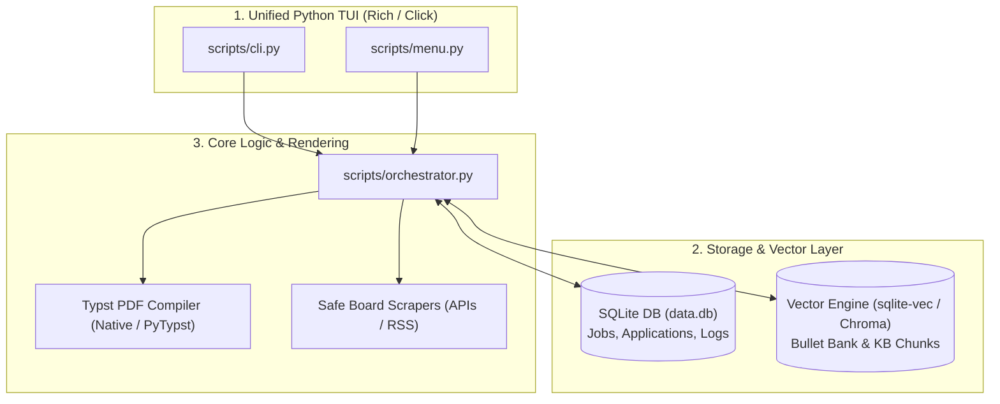

# 🏗️ Implementation Plan: Complete Modernization of `resume-builder` (Master Edition)

## Goal Description
Modernize `resume-builder` from a multi-runtime polyglot script collection into a unified, secure, high-performance, single-runtime Python application. This refactor addresses **100% of the vulnerabilities, pseudo-mathematical hacks, data corruption hazards, and architectural flaws** identified across all audits.

Key outcomes:
1. **Single Runtime:** Eliminate Go binaries and Node/Playwright subshell dependencies in favor of a pure Python stack.
2. **ACID Embedded Storage:** Replace filesystem directory moves (`jds/pending/`, `completed/`, `expired/`) and flat CSV logs with an **embedded SQLite database** (`sqlite3`).
3. **True Vector RAG:** Replace full-file LLM context dumping with an **embedded vector search engine** (`sqlite-vec` or `chromadb`) for semantic bullet bank mining and knowledge base retrieval.
4. **Typst Vector PDF Engine:** Replace heavy headless Chromium rendering with fast, native **Typst** vector compilation for clean ATS-friendly PDFs.
5. **Security & PII Shield:** Move sensitive contact information out of executable `.py` files, secure API key caching during runtime profile switching, and remove dangerous cookie-stealing scrapers.
6. **Honest Scoring & Single-Pass Evaluation:** Replace hardcoded piecewise linear interpolation ("Bayesian converter") with real calibrated scoring weights, and merge split LLM evaluation prompts to cut API costs and latency by 50%.
7. **Robust TUI & Script Polish:** Fix $ZSH_VERSION installer bugs, standalone `doctor.py` execution, Pandas memory bloat, and `skills_menu.py` Ctrl+C cancellation bugs.

---

## User Review Required

> [!IMPORTANT]
> **Breaking Database & Directory Changes:**
> This refactor will transition the primary data store from filesystem directories (`jds/<profile>/pending/`, `completed/`, `expired/`) and CSV files (`bullet-bank-keepers-audited.csv`, `jd_tracker_log.csv`) into a single SQLite database (`profiles/<profile>/data.db`). Automated migration scripts will convert all existing JSON job descriptions, tracker logs, and bullet bank CSVs into SQLite tables seamlessly.

> [!WARNING]
> **Scraper Security & API Credentials:**
> `browser_cookie3` Chrome cookie extraction will be removed to eliminate account ban risks on LinkedIn. Job board scanning will use official RSS feeds, Brave Search, SerpAPI, or direct ATS endpoint APIs (`Ashby`, `Greenhouse`, `Lever`).

---

## Proposed Changes



---

### Component 1: Security, Credentials & PII Protection

#### [`MODIFY`] [`scripts/gemini_client.py`](file:///Users/morganescott/resume-builder/scripts/gemini_client.py)
* Dynamically compute `AUTH_HEADERS` on every API call rather than caching it once at module import time, preventing stale API key leaks during runtime profile switches.

```python
# Before (Buggy static constant):
# AUTH_HEADERS = {"x-goog-api-key": API_KEY}

# After (Dynamic function):
def get_auth_headers() -> dict[str, str]:
    api_key = os.environ.get("GEMINI_API_KEY") or os.environ.get("GOOGLE_API_KEY")
    return {"x-goog-api-key": api_key, "Content-Type": "application/json"}
```

#### [`MODIFY`] [`scripts/profile_paths.py`](file:///Users/morganescott/resume-builder/scripts/profile_paths.py)
* Add `gemini_client` to `_RELOAD_ON_PROFILE_SWITCH` tuple so module environment variables are explicitly reset when switching profiles.

#### [`MODIFY`] [`profiles/morgan/fixed_content.py`](file:///Users/morganescott/resume-builder/profiles/morgan/fixed_content.py)
* Extract PII out of raw executable Python source code into encrypted or key-value environment configuration (`profile.yml`).

---

### Component 2: Embedded Database Migration (SQLite)

#### [`NEW`] [`scripts/db.py`](file:///Users/morganescott/resume-builder/scripts/db.py)
* Provide unified SQLite database connection management, ACID transactions, migrations, and schema definitions.

```sql
-- Core Schema in profiles/<profile>/data.db
CREATE TABLE IF NOT EXISTS jobs (
    id TEXT PRIMARY KEY,
    title TEXT NOT NULL,
    company TEXT NOT NULL,
    location TEXT,
    raw_text TEXT NOT NULL,
    status TEXT CHECK(status IN ('pending', 'evaluating', 'tailored', 'applied', 'expired', 'archived')),
    capability_score REAL,
    recruiter_score REAL,
    final_score REAL,
    metadata_json TEXT,
    created_at TIMESTAMP DEFAULT CURRENT_TIMESTAMP,
    updated_at TIMESTAMP DEFAULT CURRENT_TIMESTAMP
);

CREATE TABLE IF NOT EXISTS bullet_bank (
    id TEXT PRIMARY KEY,
    company TEXT NOT NULL,
    title TEXT NOT NULL,
    raw_bullet TEXT NOT NULL,
    polished_bullet TEXT,
    category TEXT,
    metric_value TEXT,
    action_verb TEXT,
    audit_status TEXT DEFAULT 'CLEAN',
    created_at TIMESTAMP DEFAULT CURRENT_TIMESTAMP
);

CREATE TABLE IF NOT EXISTS application_log (
    id INTEGER PRIMARY KEY AUTOINCREMENT,
    job_id TEXT REFERENCES jobs(id),
    company TEXT NOT NULL,
    role TEXT NOT NULL,
    status TEXT NOT NULL,
    applied_at TIMESTAMP DEFAULT CURRENT_TIMESTAMP,
    notes TEXT
);
```

#### [`NEW`] [`scripts/migrate_filesystem_to_db.py`](file:///Users/morganescott/resume-builder/scripts/migrate_filesystem_to_db.py)
* Scan existing `jds/<profile>/` directories and CSV logs (`bullet-bank-keepers-audited.csv`, `jd_tracker_log.csv`) and import all historical records into SQLite seamlessly.

#### [`MODIFY`] [`scripts/jd_manager.py`](file:///Users/morganescott/resume-builder/scripts/jd_manager.py)
* Refactor file moves (`shutil.move`) to SQLite status updates (`UPDATE jobs SET status = 'completed' WHERE id = ?`).

---

### Component 3: Embedded Vector RAG & Soft Bullet Selection

#### [`NEW`] [`scripts/vector_store.py`](file:///Users/morganescott/resume-builder/scripts/vector_store.py)
* Replace raw string context dumping in [`orchestrator.py`](file:///Users/morganescott/resume-builder/scripts/orchestrator.py) with an embedded vector store (`sqlite-vec` or `chromadb`).
* Index bullet bank achievements and knowledge base documents as dense vector embeddings using `gemini-embedding-2`.
* Implement top-k semantic search to query only relevant achievement bullets and context chunks for a specific job description, dramatically reducing token usage and latency.

#### [`MODIFY`] [`scripts/mine_bullet_bank.py`](file:///Users/morganescott/resume-builder/scripts/mine_bullet_bank.py)
* Replace hard exclusions for duplicate opening verbs and metrics with a **soft-penalty scoring algorithm** so top-tier relevant achievements are never discarded in small bullet banks.

---

### Component 4: Safe Scrapers, Robust Liveness & Stale Sweeps

#### [`MODIFY`] [`scripts/scan_linkedin.py`](file:///Users/morganescott/resume-builder/scripts/scan_linkedin.py)
* Delete `browser_cookie3` Chrome cookie extraction. Replace unauthenticated cookie scraping with safe search providers (Brave Search API, SerpAPI, official RSS feeds).

#### [`MODIFY`] [`scripts/liveness.py`](file:///Users/morganescott/resume-builder/scripts/liveness.py)
* Replace naive inner-text regex matching with structured HTTP status inspections, canonical URL redirect tracking, and dynamic SPA state evaluation.

#### [`MODIFY`] [`scripts/stale_sweep.py`](file:///Users/morganescott/resume-builder/scripts/stale_sweep.py)
* Update archiving logic to verify active URL status via liveness check before auto-archiving unreviewed roles.

---

### Component 5: Typst Vector PDF Engine

#### [`NEW`] [`scripts/render_typst.py`](file:///Users/morganescott/resume-builder/scripts/render_typst.py)
* Create Typst resume templates (`templates/resume.typ`) to replace Jinja HTML and Playwright Chromium headless subshells.
* Typst compiles sub-second, sub-5MB vector PDFs with 100% ATS-parseable text layers without font subsetting or bullet-to-pipe (`•` $\rightarrow$ ` | `) character corruption.

---

### Component 6: Single-Pass Evaluation & Honest Probability Scoring

#### [`MODIFY`] [`scripts/orchestrator.py`](file:///Users/morganescott/resume-builder/scripts/orchestrator.py) & [`scripts/batch_evaluate.py`](file:///Users/morganescott/resume-builder/scripts/batch_evaluate.py)
1. **Single-Pass LLM Evaluation:** Combine `evaluate_capability.md` and `evaluate_recruiter.md` into a single structured Pydantic schema call, halving API calls, execution time, and cost.
2. **Honest Probability Calibration:** Remove pseudo-mathematical `points = [(1.0, 0.1)...]` piecewise linear interpolation. Replace marketing hyperbole with an explicit, empirical weighted fit score (0–100%) and transparent rubric breakdown.

---

### Component 7: Single-Runtime TUI, Installer & Script Cleanup

#### [`MODIFY`] [`scripts/install.sh`](file:///Users/morganescott/resume-builder/scripts/install.sh)
* Fix `$ZSH_VERSION` detection bug and provide clean setup/uninstall options for shell aliases.

#### [`MODIFY`] [`scripts/doctor.py`](file:///Users/morganescott/resume-builder/scripts/doctor.py)
* Add `if __name__ == "__main__":` entry point so `python scripts/doctor.py` can be executed directly as a standalone utility.

#### [`MODIFY`] [`scripts/audit_keepers.py`](file:///Users/morganescott/resume-builder/scripts/audit_keepers.py) & [`scripts/rewrite_bullets.py`](file:///Users/morganescott/resume-builder/scripts/rewrite_bullets.py)
* Replace `pandas` CSV operations with standard library `csv` module and `sqlite3` queries to eliminate ~100MB+ memory bloat and integer-to-float column corruption bugs.

#### [`MODIFY`] [`scripts/skills_menu.py`](file:///Users/morganescott/resume-builder/scripts/skills_menu.py) & [`scripts/menu.py`](file:///Users/morganescott/resume-builder/scripts/menu.py)
* Add explicit `KeyboardInterrupt` / `Ctrl+C` cancellation state handling to prevent incomplete, corrupted JSON objects from saving.
* Add automatic ASCII font fallback detection for non-Nerd-Font terminal environments.

---

## Verification Plan

### Automated Tests
Run automated tests including end-to-end ATS PDF parse verification:
```bash
# Run unit & integration test suite
.venv/bin/python -m unittest discover -s tests -p "test_*.py"

# Verify standalone doctor script execution
.venv/bin/python scripts/doctor.py

# Verify SQLite filesystem migration
.venv/bin/python scripts/migrate_filesystem_to_db.py --dry-run

# Run E2E ATS PDF text extraction test (verify zero bullet-to-pipe or font subsetting issues)
.venv/bin/python tests/test_pdf_ats_parsing.py
```

### Manual Verification
1. **Database Verification:** Execute `python scripts/cli.py list` to verify job status listing reads cleanly from SQLite.
2. **Typst PDF Generation:** Build a sample resume PDF using the new Typst engine and verify ATS parse rates via text extraction:
   ```bash
   pdftotext output/morgan/pdf/sample_Resume.pdf - | grep -i "Experience"
   ```
3. **Vector Search Query:** Verify top-k semantic bullet retrieval for a sample JD query.
4. **Interactive TUI Test:** Test `Ctrl+C` cancellation in `skills_menu.py` to confirm no partial JSON records are written.
