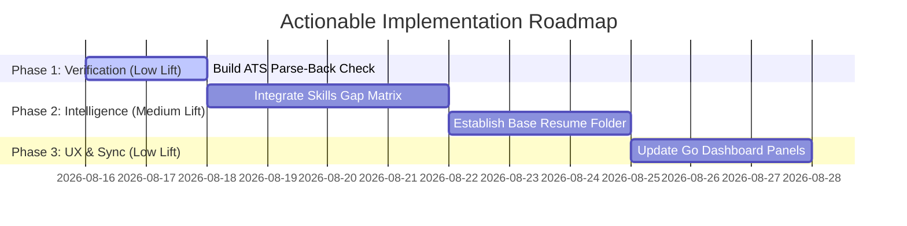

# 🔬 Objective Assessment: Elevating Resume-Builder using JobRight & Industry Research

We have conducted a thorough, line-by-line review of the files in your `ImprovementConcepts` directory, including:
* Custom reverse-engineering analyses of JobRight's public MCP server tools (`parser_resume`, `diagnose_resume`, `update_resume`).
* Deep dives into JobRight's 5-dimensional scoring systems and web tool pipeline.
* Draft reports on introducing a **Base-Resume Archetype Selection** and **Gap Analysis Matrix**.
* Lists of potential open-source NLP, embedding, and fuzzy-matching libraries (`requirements.txt` / `resourceideas.rtf`).

Below is an objective, highly realistic engineering assessment of which parts of this research are **gold mines** worth building, which are **overkill** that need to be simplified, and which are **fool's gold** that should be discarded entirely.

---

## 🗺️ Conceptual Classification at a Glance

| Research Concept | Action | Engineering Lift | Core Value Proposition |
| :--- | :--- | :--- | :--- |
| **Gap Analysis (Coverage Matrix)** | **IMPLEMENT** | **Low-to-Medium** | Turns abstract scoring into a strict "to-do list" for the LLM rewrite, guaranteeing high-impact coverage. |
| **ATS Parse-Back Simulation** | **IMPLEMENT** | **Low** | Runs a local post-rendering QA check to verify that contact info, experience headers, and skills survive PDF extraction. |
| **Base-Resume (Archetype) Selection** | **ADAPT & SIMPLIFY** | **Medium** | Instead of generating from scratch, select from a few pre-structured baselines. We simplify the heavy YAML schema into a lightweight directory reader. |
| **Semantic Job Matching & Reranking** | **ADAPT & SIMPLIFY** | **High (if local)** | Instead of importing heavy deep-learning frameworks (PyTorch, FAISS), leverage the existing Gemini-Flash API or `RapidFuzz` for sub-second ranking. |
| **Local MCP SSE / JSON-Patch Server** | **DISCARD** | **Very High** | JobRight requires this for remote client-plugin sync. For a local, unified CLI/TUI, this adds massive architecture bloat with zero functional gain. |

---

## 🎯 1. High-Value, Highly Realistic Wins (The "Implement" List)

### A. The Gap Analysis & Skills Coverage Matrix (EVALUATE & TARGET)
* **What it is**: Extracting key hard skills, tools, and experience thresholds from a job description (JD), then cross-referencing them against the user’s master profile, selected base resume, and current resume draft to output a structured JSON array (e.g., `[{"skill": "AWS", "in_jd": true, "in_resume": false}]`).
* **Why it is worth it**: **This is a massive win.** Currently, your orchestrator asks the LLM to analyze the JD and rewrite your bullets in a single, high-cognitive-load pass. Shifting to an explicit gap analysis step does two things:
  1. **Deterministic Guarantees**: It generates a transparent, human-readable "to-do list" in your TUI/CLI showing exactly which skills are matched vs. missing (similar to Jobscan or Teal).
  2. **Coached Rewriting**: Instead of telling the LLM to "tailor the resume," you pass the explicit gap list as a parameter: *"Here are the 3 missing hard skills. Inject these naturally using exact facts from the approved bullet bank."*
* **Implementation Path**: Add a `coverage_matrix` field to your JD JSON structure in `jd_manager.py`. Compute it after scanning using lightweight text matching, and display it as an elegant panel in your Go dashboard.

### B. ATS Parse-Back Simulation (VERIFY)
* **What it is**: After rendering your PDF using Playwright, run a local Python task to parse the PDF text back using `pdfminer.six` (already in your `requirements.txt`!), simulating how an ATS parser (like Greenhouse or Workday) reads the file.
* **Why it is worth it**: **Incredibly high utility for almost zero lift.** In the real world, 15–25% of candidates are lost not because their skills are weak, but because their PDF's text layer is scrambled, has ligature issues (e.g., `fi`/`fl` rendering as weird Unicode characters), or has column interleaving.
* **Implementation Path**:
  1. Add a helper function `simulate_ats_parse(pdf_path)` to `validate_resume.py`.
  2. Use `pdfminer.six` to extract raw strings.
  3. Run structural assertions: Ensure your name is at the top, sections like "Experience" and "Skills" are successfully detected as distinct blocks, and standard contact info is extracted cleanly.
  4. If assertions fail, raise a linter error to halt the build before you waste time applying with a corrupt file.

---

## 🧠 2. Sophisticated but Overkill (The "Adapt & Simplify" List)

### A. Base-Resume (Archetype) Selection & Planning Layer (PLAN)
* **What the research suggests**: Defining 4–6 highly detailed, structured YAML profiles representing career archetypes (e.g., "Digital Marketing", "Content & Creative"), each with a strict schema of fields, metadata, and keywords, scored using a complex multi-variable formula.
* **The Reality Check**: While the *strategy* of using archetypes is fantastic (it prevents your layout from being shredded by generating from scratch every time), a highly nested YAML schema registry is brittle. It forces you to maintain redundant copies of your work history across several files, creating a major sync headache.
* **The Smart Adaptation**:
  - Keep the concept: Maintain 3–4 static "base resumes" as standard, beautifully structured JSON files in a dedicated folder: `profiles/<profile>/base_resumes/`.
  - When a new JD comes in, instead of a heavy multi-weight algorithm, use a lightweight cosine-similarity score to see which base resume’s text content aligns closest with the JD description.
  - Choose that base, copy its structure, and use your gap analysis to rewrite *only* the bullets and skills necessary. This keeps your formatting 100% stable while ensuring your content remains focused.

### B. Semantic Job Matching & Reranking (SCALE)
* **What the research suggests**: Installing local deep-learning models (`Sentence-Transformers`, `HuggingFace Transformers`, `Ollama`) and setting up local vector indexes (`FAISS`) to embed and rank saved jobs.
* **The Reality Check**: This is a classic "dependency trap." Installing `torch`, `sentence-transformers`, and `FAISS` on your Mac/Android devices will add **gigabytes** of bloat to your environment, slow down your CLI cold starts to several seconds, and drain mobile battery life. 
* **The Smart Adaptation**:
  - You do *not* need local deep learning. You are already using the Gemini API.
  - When scanning or importing a list of job descriptions, execute asynchronous, lightweight batch calls to the Gemini-Flash embedding endpoint (or use a tiny, lightning-fast library like `RapidFuzz` for title/keyword matches).
  - This keeps your terminal user interface launching in **sub-10 milliseconds**, keeps your codebase clean, and saves you from setting up local database servers.

---

## 🚫 3. Overdesigned Features (The "Discard" List)

### A. Local MCP SSE / JSON-Patch Server Architecture
* **What the research suggests**: Re-implementing JobRight's headless Model Context Protocol (MCP) server endpoint (`https://mcp.jobright.ai/mcp`) locally over Server-Sent Events (SSE) and applying edits via RFC-6902 styled JSON patches (`indexPath`, `action`, `value`).
* **The Reality Check**: **Discard this immediately.** JobRight built an MCP SSE server because their AI engine lives in the cloud and needs a secure, structured way to interact with client-side files and web-extension interfaces. 
* **Why it hurts your project**: You have a fully local Python and Go codebase. Forcing yourself to run a persistent background web server that communicates via HTTP Server-Sent Events and applies nested JSON patches is massive architectural over-engineering. It introduces file-concurrency locks, state-sync issues, and security boundaries that only serve to make debugging your code a nightmare. Keep your data manipulations in simple, direct local file operations.

---

## ⚡ ADHD-Friendly, Frictionless UX Alignment

As a personalized career operations pipeline, your system’s biggest risk is **cognitive fatigue**. Traditional resume checkers overwhelm you with a massive firehose of red circles, low percentages, and warning boxes. 

To keep this tool inspiring and highly useful, we suggest adopting a **"Progressive Disclosure" UX**:
1. **The Quick Wins View**: In your Go dashboard's progress panel, show exactly **three key missing skills** at a time. Do not show fifty. Focus on the high-weight gaps.
2. **"All-Star" Auto-Tailoring**: Build upon the "dispatcher scheduler" idea from your roadmap. If a scanned job scores >= 95% out-of-the-box against your preferred base resume, let the background agent auto-generate and render the PDF completely unattended. It should just drop a "Ready to Apply" PDF into your folder so you can apply with one click, bypassing the editing screen entirely.
3. **Painless Approvals**: When human eyes are needed, present a simple, binary terminal prompt: *"We added AWS to your campaigns bullet. Old: 'Led cloud scaling.' New: 'Led AWS cloud scaling.' Accept? [Y/n]"*.

---

## 📈 Suggested Actionable Roadmap

If you want to begin implementing these ideas, we suggest starting with these three scoped, high-impact milestones:

1. **Milestone 1 (Liveness & Safety Check)**: Add the `pdfminer.six` extraction checker to your `validate_resume.py` pipeline. This gives you instant safety guarantees that every PDF rendered is actually readable.
2. **Milestone 2 (The Gap Matrix)**: Update your `evaluate` and `tailor` scripts to generate and store the `coverage_matrix` JSON in your `jd_manager.py` state. 
3. **Milestone 3 (Base Switching)**: Create the `profiles/default/base_resumes/` folder structure, and let the orchestrator copy the closest matching file before running its tailoring loop.

---

> [!TIP]
> **Summary Recommendation**: Do not try to clone JobRight’s massive cloud architecture. Instead, steal their **analytical discipline**—specifically the sequential Gap Analysis and PDF Parse Validation—and implement them using your ultra-lightweight, local Python-and-Go tools. This elevates your program to a professional standard of performance and accuracy without losing its blazing-fast, secure, local-first soul.

### ❓ Key Decisions & Next Steps
1. **Bases Selection**: Do you already have 2–3 different variations of your resume (e.g., technical vs. product/managerial) in raw text format that we can use to initialize your `base_resumes/` folder?
2. **Go UI**: Would you like to map out the exact placement of the new **Skills Gap Table** inside your current Bubble Tea Progress screen?
