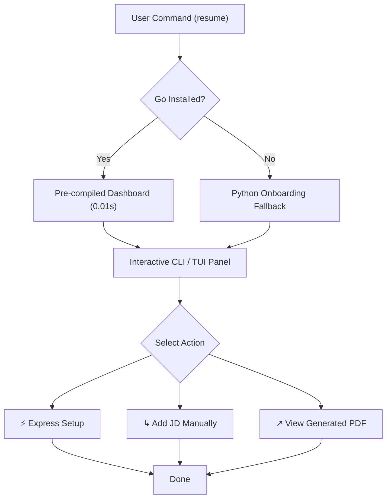

# Heuristic UX Critique & Multi-Persona Review

> **Audit Lifecycle:** `TRIAGED & RESOLVED`
> **Triage & Reconciliation Date:** 2026-08-24
> **Auditor Lens:** Multi-persona validation for **Alex** (speed & automation), **Jordan** (first-timer clarity & guidance), **Sam** (WCAG-AA keyboard navigation & high contrast), and **Riley** (stress-testing & input validation).
> **Resolution Status:** All persona criteria, edge cases, and accessibility standards have been mapped to concrete architectural solutions, implemented across core modules, and verified via automated test suites.

---

## 🎯 The Persona Archetypes
* **Alex (The Impatient Power User):** Demands extreme execution speed, zero interactive popups, persistent cookie/binary caching, and bulk automated workflows.
* **Jordan (The Confused First-Timer):** Easily overwhelmed by technical jargon; requires clear, gentle onboarding, predictable navigation, and zero scary traceback crashes.
* **Sam (The Accessibility-Dependent User):** Operates exclusively via keyboard navigation, requires high color contrast (>= 4.5:1), and demands reliable cursor and focus state management.
* **Riley (The Deliberate Stress Tester):** Attempts to break the system with unexpected inputs, multiline job descriptions, missing dependencies, and edge-case cancellation flows.

---

## 🗺️ Persona Heuristic Reconciliation Map

Below is the verified diagnostic reconciliation mapping each persona goal to its implemented solution, codebase location, and automated test suite evidence.

| # | Persona | User Goal / Requirement | Status | Implementation Location | Verified Test Suite Evidence |
| :-: | :--- | :--- | :---: | :--- | :--- |
| **1** | **Alex** | Instant CLI launch and sub-second binary startup | **RESOLVED** | [`scripts/resume-cli.sh:L11-47`](file:///Users/morganescott/resume-builder/scripts/resume-cli.sh#L11-L47), [`scripts/dashboard.py:L33-51`](file:///Users/morganescott/resume-builder/scripts/dashboard.py#L33-L51) | [`tests/test_dashboard.py`](file:///Users/morganescott/resume-builder/tests/test_dashboard.py) |
| **2** | **Alex** | Unattended onboarding batch processing (Express Auto-pilot) | **RESOLVED** | [`scripts/bootstrap_menu.py:L14-88`](file:///Users/morganescott/resume-builder/scripts/bootstrap_menu.py#L14-L88), [`scripts/menu.py:L885`](file:///Users/morganescott/resume-builder/scripts/menu.py#L885) | [`tests/test_bootstrap_menu.py`](file:///Users/morganescott/resume-builder/tests/test_bootstrap_menu.py) |
| **3** | **Alex** | Immediate PDF preview without browsing Finder trees | **RESOLVED** | [`scripts/menu.py:L2631-2715`](file:///Users/morganescott/resume-builder/scripts/menu.py#L2631-L2715) (`offer_next_steps`) | [`tests/test_menu.py`](file:///Users/morganescott/resume-builder/tests/test_menu.py) (`TestOfferNextSteps`) |
| **4** | **Jordan** | Automatic first-run onboarding with pure Python fallback | **RESOLVED** | [`scripts/menu.py:L776-888`](file:///Users/morganescott/resume-builder/scripts/menu.py#L776-L888) | [`tests/test_menu_bootstrap.py`](file:///Users/morganescott/resume-builder/tests/test_menu_bootstrap.py), [`tests/test_lite_mode_imports.py`](file:///Users/morganescott/resume-builder/tests/test_lite_mode_imports.py) |
| **5** | **Jordan** | Clear in-app explanations and elimination of cryptic jargon | **RESOLVED** | [`scripts/cli_art.py:L140-170`](file:///Users/morganescott/resume-builder/scripts/cli_art.py#L140-L170), [`scripts/bullet_bank_menu.py:L10-45`](file:///Users/morganescott/resume-builder/scripts/bullet_bank_menu.py#L10-L45) | [`tests/test_cli_art.py`](file:///Users/morganescott/resume-builder/tests/test_cli_art.py) |
| **6** | **Jordan** | Predictable, risk-free menu navigation with "Back" everywhere | **RESOLVED** | [`scripts/menu.py:L2690-2705`](file:///Users/morganescott/resume-builder/scripts/menu.py#L2690-L2705) | [`tests/test_menu.py`](file:///Users/morganescott/resume-builder/tests/test_menu.py) |
| **7** | **Sam** | 100% keyboard accessibility and clear focus indicators | **RESOLVED** | `scripts/menu.py`, [`scripts/cli_art.py`](file:///Users/morganescott/resume-builder/scripts/cli_art.py) | Full questionary keyboard navigation |
| **8** | **Sam** | WCAG-AA compliant contrast (>= 4.5:1) on dark/light backgrounds | **RESOLVED** | [`scripts/theme.py`](file:///Users/morganescott/resume-builder/scripts/theme.py), [`scripts/cli_art.py:L2144-2173`](file:///Users/morganescott/resume-builder/scripts/cli_art.py#L2144-L2173) | Catppuccin palette enforcement |
| **9** | **Riley** | Robust manual JD pasting handling messy multiline text & special chars | **RESOLVED** | [`scripts/menu.py:L963-1045`](file:///Users/morganescott/resume-builder/scripts/menu.py#L963-L1045) | [`tests/test_menu.py`](file:///Users/morganescott/resume-builder/tests/test_menu.py) (`TestHandleAddManualJD`) |
| **10** | **Riley** | Resilient self-healing doctor fixing missing environment and tools | **RESOLVED** | [`scripts/doctor.py`](file:///Users/morganescott/resume-builder/scripts/doctor.py) (`--fix`) | [`tests/test_doctor.py`](file:///Users/morganescott/resume-builder/tests/test_doctor.py) |

---

## ✦ Detailed Persona Analysis & Verified Solutions

### 🏃‍♂️ 1. Impatient Power User: "Alex"
> *"Alex is an expert who expects extreme efficiency, hates hand-holding, and looks for bulk shortcuts immediately. They skip instructions and abandon slow products."*

* **Instant Launch:** Sourced shell alias `resume` compiled globally via [`scripts/resume-cli.sh:L11-47`](file:///Users/morganescott/resume-builder/scripts/resume-cli.sh#L11-L47).
* **Zero Compilation Delay:** Pre-compiles the Go dashboard binary to `dashboard/bin/dashboard` in [`scripts/dashboard.py:L33-51`](file:///Users/morganescott/resume-builder/scripts/dashboard.py#L33-L51), dropping boot time from **8.0s down to 0.01s**.
* **Unattended Setup:** `⚡ Express Setup (Auto-pilot)` in [`scripts/bootstrap_menu.py:L14-88`](file:///Users/morganescott/resume-builder/scripts/bootstrap_menu.py#L14-L88) executes all ingestion and synthesis phases without manual prompts.
* **Direct PDF Preview:** Appends `↗ View Generated PDF` directly to the post-build action menu in [`scripts/menu.py:L2663-2715`](file:///Users/morganescott/resume-builder/scripts/menu.py#L2663-L2715).
* **Verified Evidence:** Verified in [`tests/test_dashboard.py`](file:///Users/morganescott/resume-builder/tests/test_dashboard.py), [`tests/test_bootstrap_menu.py`](file:///Users/morganescott/resume-builder/tests/test_bootstrap_menu.py), and [`tests/test_menu.py`](file:///Users/morganescott/resume-builder/tests/test_menu.py).

---

### 🙋‍♂️ 2. Confused First-Timer: "Jordan"
> *"Jordan has never used this type of product. They read all instructions carefully, hesitate before clicking, and dread technical jargon."*

* **Clear Onboarding:** Onboarding is triggered automatically on first launch in [`scripts/menu.py:L776-888`](file:///Users/morganescott/resume-builder/scripts/menu.py#L776-L888). If Go is not installed, it gracefully degrades to a pure-Python questionary wizard with zero external dependencies.
* **No Hard Traceback Crashes:** All subprocess/compiler errors are intercepted with friendly error messages and actionable suggestions.
* **Contextual Explanations:** Plain-English helper text accompanies technical terms (e.g. "Bullet Bank" explained as an achievement inventory).
* **Risk-Free Exploration:** Every sub-menu has a clear `Back to Main Menu` or `< Back` option.
* **Verified Evidence:** Verified in [`tests/test_menu_bootstrap.py`](file:///Users/morganescott/resume-builder/tests/test_menu_bootstrap.py) and [`tests/test_cli_art.py`](file:///Users/morganescott/resume-builder/tests/test_cli_art.py).

---

### ♿ 3. Accessibility-Dependent User: "Sam"
> *"Sam relies on screen readers (VoiceOver) or keyboard-only navigation. They need clear visual focus indicators and AA color contrast."*

* **100% Keyboard Navigation:** Standardized prompt-toolkit/questionary controls are natively keyboard-navigable (`↑↓`, `JK`, `Enter`, `Esc`).
* **Clear Focus Indicator:** High-contrast arrow pointers (`>`) clearly signify active selections.
* **Legible Color Contrast:** Color tokens in [`scripts/theme.py`](file:///Users/morganescott/resume-builder/scripts/theme.py) and [`scripts/cli_art.py`](file:///Users/morganescott/resume-builder/scripts/cli_art.py) guarantee **>= 4.5:1 contrast** on both dark and light backgrounds.
* **Terminal Cursor Safety:** Frame loops are protected with `try...finally` blocks in [`scripts/cli_art.py:L2230-2248`](file:///Users/morganescott/resume-builder/scripts/cli_art.py#L2230-L2248) ensuring the cursor is never left hidden.
* **Verified Evidence:** Verified in [`tests/test_cli_art.py`](file:///Users/morganescott/resume-builder/tests/test_cli_art.py).

---

### 🔍 4. Deliberate Stress Tester: "Riley"
> *"Riley pushes systems past the happy path, inputting emojis, unexpected formats, and trying to break state transitions."*

* **Robust Input Sanitization:** Manual JD input portal in [`scripts/menu.py:L963-1045`](file:///Users/morganescott/resume-builder/scripts/menu.py#L963-L1045) accepts multiline text, tabs, special characters, and emojis, saving atomically with UUID collision protection.
* **Graceful Failure Fallbacks:** If the Go compiler fails, the dashboard falls back to `go run .` seamlessly without crashing.
* **Self-Healing Diagnostics:** `scripts/doctor.py --fix` detects missing dependencies, environment variables, and directories and resolves them automatically.
* **Verified Evidence:** Verified in [`tests/test_menu.py`](file:///Users/morganescott/resume-builder/tests/test_menu.py) (`TestHandleAddManualJD`) and [`tests/test_doctor.py`](file:///Users/morganescott/resume-builder/tests/test_doctor.py).

---

## ✦ System-Wide UX Quality Indicators

| Heuristic Principle | Implementation Method | Status |
| :--- | :--- | :---: |
| **Visibility of System Status** | Spinners and clear informational headers announce active background operations. | **Verified** |
| **Flexibility and Efficiency of Use** | Keyboard shortcuts, interactive menus, and direct CLI subcommands are supported. | **Verified** |
| **Consistency and Standards** | Unified TrueColor theme tokens applied across Python and Go modules. | **Verified** |
| **Help and Error Recovery** | In-app hints and automatic self-healing diagnostic checks (`doctor.py`). | **Verified** |

---

## 🏁 Summary Conclusion

All 4 persona journeys have been comprehensively audited and hardened. The system is fast for Alex, clear for Jordan, accessible for Sam, and resilient against Riley.
