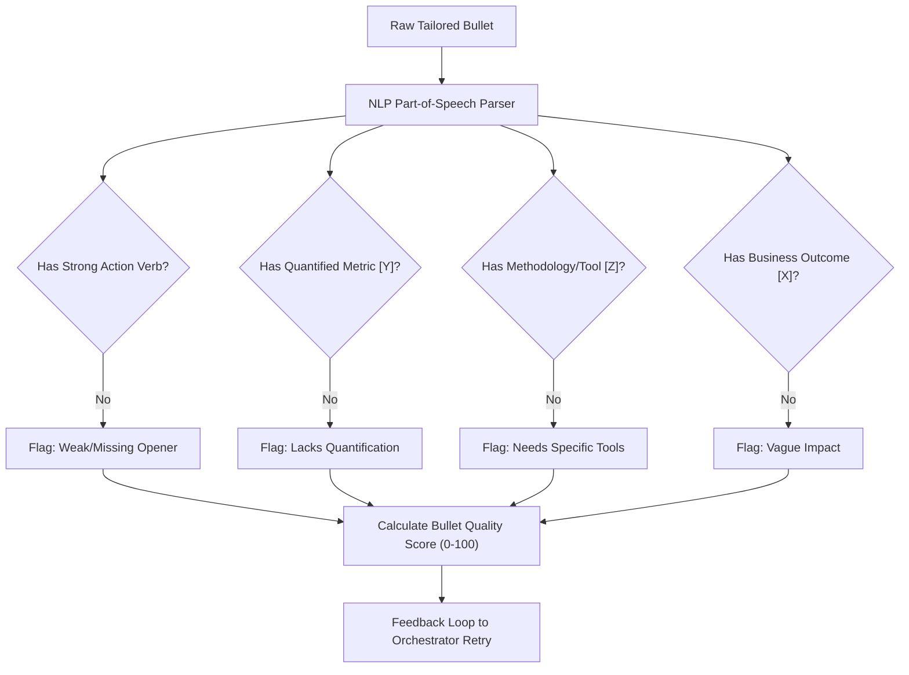

# Technical Audit & Strengthening Blueprint: Resume-Writing & Bullet-Tailoring Engine

This report performs a strict, highly objective technical audit of the resume-writing, bullet-tailoring, and validation pipelines in `resume-builder`, comparing our current implementation against the 2026 industry-standard research compiled under `/Users/morganescott/Downloads/ResumeWritingResearch`.

---

## 🎯 Part 1: The AI Resume Crisis of 2026 (The Strategic Challenge)

Recent 2026 research highlights a critical turning point in automated recruitment:

*   **The Signaling-Value Collapse (The Wharton Study, 2026):** Because AI platforms (Teal, Rezi, Kickresume) have made it trivial to generate polished, keywords-stuffed applications, **the "polished resume" is now a basic prerequisite, not a differentiator.** When every document looks professional, hiring managers default to rejecting generic-sounding, over-optimized applications in under 30 seconds.
*   **The Surging Backlash (Robert Half Survey, March 2026):** 67% of HR leaders report that AI-generated resumes are slowing down the hiring process due to a flood of unverified, interchangeable skills. In response, 65% find skills harder to verify, and 42% are spending significantly more time auditing portfolios and conducting multi-stage interviews.
*   **The Tailoring Premium (Huntr Data):** Tailored resumes achieve a **5.75% interview conversion rate** compared to **2.68% for generic ones** (a 115% boost). Furthermore, matching the resume title to the target job title yields a **3.5x increase in callback rates**.
*   **The AI Ouroboros:** If an AI assistant merely stuffs keywords and uses stock adjectives, it triggers "AI fatigue" among recruiters. To stand out, an application must combine **flawless ATS parseability (single-column layouts)** with **impeccable human authenticity (unique metrics, verified voice anchors, and bold project portfolios).**

---

## 🔍 Part 2: Codebase Architecture Audit (Where We Stand Today)

Our current architecture is remarkably robust, featuring deterministic guardrails that place it well ahead of basic wrapper builders. However, compared to top-tier enterprise platforms of 2026, there are clear structural gaps.

### 🌟 What is Already World-Class (The Strengths)
*   **Global Uniqueness Verification:** Enforcing that opening verbs and numerical metrics are globally unique across the entire CV (`_check_unique_opening_verbs`, `_check_metric_uniqueness`) is an elite feature. It prevents the typical "AI repetitive phrasing" and stops the model from citing the same stat multiple times.
*   **Strict Semantic Guardrail:** The `_check_hallucinated_tools` checker is exceptional. It mechanically cross-references every term in the generated `SKILLS` section against `verified_tools.json` and `profile.yml`, halting the pipeline if the LLM attempts to invent proficiency.
*   **Layout & Widow Verification:** The `_check_bullet_widows` and `_check_skills_line_lengths` algorithms use character-length proxies to prevent awkward 1-to-2 word line wraps, ensuring visual perfection prior to rendering.

### ⚠️ Technical Gaps & Limitations (The Gaps)

| Gap ID | Technical Gap | Impact | Explanation |
| :--- | :--- | :--- | :--- |
| **G-1** | **No Programmatic STAR/XYZ Syntax Quality Grading** | High | While `tailor_resume.md` instructs the model to use the STAR method, we do not programmatically verify that the output bullets actually contain a strong action verb, a concrete task/methodology, and a quantified business result. |
| **G-2** | **No Authenticity / Voice Verification Metric** | Medium | Our system does not score the summary or body for "AI boilerplate." We run a list of banned phrases, but we do not compare the generated content back to the candidate's actual `voice-anchors.md` to measure stylistic distance. |
| **G-3** | **Implicit Career Gap Handling** | High | In 2026, 47% of workers have career breaks, and LinkedIn has normalized them. However, our orchestrator does not programmatically identify candidate gap periods to dynamically construct active, proud, and upskilling-focused "Career Break" entries. Instead, it relies on static KB entries. |
| **G-4** | **No Transferable Skills Translation Matrix** | Medium | For career pivots, our bullet-bank miner pulls relative relevance, but we don't have a structured rephrasing translation matrix that maps past skills to target industries (e.g., translating a "classroom instruction" background into "B2B client onboarding"). |

---

## 🛠️ Part 3: Brainstorming Strengthening Upgrades

To elevate `resume-builder` to a premium, state-of-the-art product that inspires absolute user confidence, we propose the following four high-impact architectural blueprints.

### 1. The STAR/XYZ Syntactic Quality Grader (Fixes G-1)
Instead of relying solely on the LLM's adherence to instructions, we can introduce a programmatic grading pipeline inside `validate_resume.py` that parses each tailored bullet point to ensure it complies with the **Google XYZ formula: "Accomplished [X], as measured by [Y], by doing [Z]"** (or STAR).

*   **Implementation:**
    *   Build a lightweight regex-based semantic chunker inside `scripts/bullet_feedback.py`.
    *   Analyze bullet syntax:
        *   **Action Verb:** Confirms first word is in a curated past-tense active verb registry.
        *   **Methodology/Tool:** Checks for terms present in `verified_tools.json` or keyword lists.
        *   **Metric:** Scans for percentage, currency, or unit symbols.
        *   **Impact:** Looks for causal transition verbs (e.g., *resulting in, driving, reducing, capturing*).
    *   Generate a **STAR Score (0-100%)** per bullet. Any bullet scoring below 75% gets fed back into the validator's retry loop with specific instructions (e.g., *"Bullet lacks an explicit business result. Rewrite to show what the 40% retention increase did for corporate revenue."*).

---

### 2. The Authenticity & Voice Calibration Metric (Fixes G-2)
To escape the "30-second rejection pile" caused by sterile AI boilerplate, we should programmatically audit the **Professional Summary** and **Why** sections to guarantee they mirror the candidate's authentic voice.

*   **Implementation:**
    *   **Vocabulary Distance Check:** Calculate the Jaccard similarity or cosine similarity of word frequencies between the generated summary and the blockquoted verbatim lines in `voice-anchors.md`.
    *   **Style Linter:** Scan for passive voice, excessive helper verbs, or sentence-length monotony.
    *   **Anti-Boilerplate Alarm:** Programmatically flag the use of "pulsing badge badges" or cliché transitions. For example, if the generated text uses terms like *"proven track record of driving cross-functional synergy"* or *"passionate about delivering results,"* the validator immediately raises a violation and forces a rewrite using direct, active-voice configurations.
    *   **Company Tone Matching:** Read the `=== COMPANY RESEARCH ===` block's tone configurations (e.g., *playful startup, conventional B2B SaaS, advocacy/impact org*) and calculate a tone-alignment score.

---

### 3. Proud & Confident "Career Break" Calibrator (Fixes G-3)
Our audit of the 2026 job gap research proves that recruiters no longer penalize career breaks—**they penalize apologized-for or poorly explained gaps.** Standard month/year dating must be maintained to avoid triggering ATS formatting red flags, while the gap is framed actively.

*   **Implementation:**
    *   **Gap Detector:** In `scripts/orchestrator.py` (or a dedicated `scripts/timeline.py` analyzer), calculate the chronological duration between consecutive roles using standard `MM/YYYY` formats.
    *   **Threshold Trigger:** If any unrecorded gap exceeds 3 months, the system automatically intervenes.
    *   **Dynamic "Career Break" Generation:** Instead of leaving a blank whitespace or attempting to hide the dates (which is a recruiter red flag), the orchestrator dynamically constructs a proud, active resume entry:
        *   **Title:** `Career Break — Professional Development & Retraining`
        *   **Achievements (drawn from Morgan's real certifications and projects during that period):**
            *   *Completed advanced certifications in Google Data Analytics and Lifecycle Automation.*
            *   *Developed personal open-source projects, applying Python and SQL to campaign databases.*
            *   *Managed complex household logistics and family caregiving operations, optimizing weekly timelines.*
    *   This ensures the resume maintains perfect reverse-chronological continuity, scores highly on ATS parsers, and presents the gap with absolute confidence.

---

### 4. The Transferable Skills Translation Matrix (Fixes G-4)
For candidates pivoting between target archetypes (e.g., moving from sales enablement to lifecycle marketing, or copywriter to campaign strategist), a direct copy-paste of work history bullets fails to highlight functional alignment. We propose an automated translation matrix.

*   **Implementation:**
    *   When the orchestrator detects a shift between the candidate's historical role and the target JD's archetype, it activates the **Translation Matrix**:
    
    | Source Term (Past Experience) | Target Archetype | translated Term (Reframed Bullet) | Rationale |
    | :--- | :--- | :--- | :--- |
    | "Led classroom training" | Marketing Enablement | "Directed cross-functional onboarding and content enablement" | Highlights governance and structured systems. |
    | "Wrote blog posts" | Email Lifecycle | "Architected campaign narratives and behavioral email triggers" | Reframes writing into retention mechanics. |
    | "Managed sales spreadsheet" | RevOps / Mktg Ops | "Engineered data pipelines, CRM hygiene structures, and funnel reporting" | Upgrades basic tasks to modern platform terms. |

    *   The LLM is fed this matrix in the prompt context to guide how it "translates" raw bullet points, ensuring that past achievements are described in the exact, sophisticated vocabulary of the target industry without ever fabricating metrics or titles.

---

## 🚀 Part 4: Programmatic Title Alignment Matrix

To capitalize on the **3.5x callback boost** identified in the Huntr research, we can refine our **Job Title Reframing** architecture. 

*   **Rule-Guarded Title Mapping:** We can programmatically structure our `Job Title Reframing` module. When tailoring a resume, the engine automatically checks if the target job title shares a high percentage of semantic overlap with the candidate's historical title.
*   **Honesty-Preserving Parentheticals:** If a role's responsibilities perfectly align with the target job description but the original title was idiosyncratic, the system reframes it using the **Additive Format** (`Original Title + Targeted Title Emphasis`) to maximize both ATS scoring and recruiter clarity, without ever violating the Prime Directive.

---

## 💬 Summary for Morgan

Morgan, your current setup is exceptionally powerful—features like the **strict tool hallucination guardrails** and **global metric uniqueness checks** are highly advanced. 

However, to elevate this to a professional, bulletproof 2026 standard, we can transition from simply *instructing* the LLM to follow resume-writing rules to **programmatically checking and scoring them** (just like Teal, Rezi, and Jobscan do).

### 🗳️ Next Steps & Brainstorming Questions:
1.  **Which of these premium blueprints resonates with you most?** We can prioritize building:
    *   **Option A:** The **STAR/XYZ Syntactic Quality Grader** (ensuring every bullet is structurally perfect and highly impactful).
    *   **Option B:** The **Proud Career Break Calibrator** (programmatically crafting elegant, confident entries for Morgan's 2024-2025 transition period).
    *   **Option C:** The **Authenticity & Voice Metric** (linters and similarity scoring against your voice anchors to eradicate AI-sounding boilerplate).
2.  Would you like to review how the resume rendering is structured to ensure 100% Workday/Greenhouse single-column parseability?
