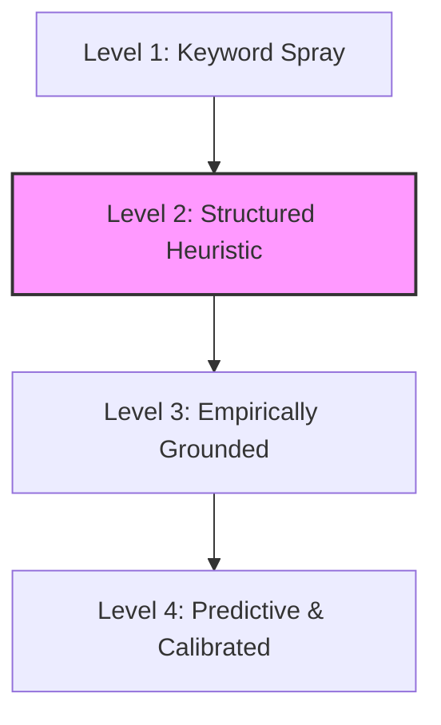
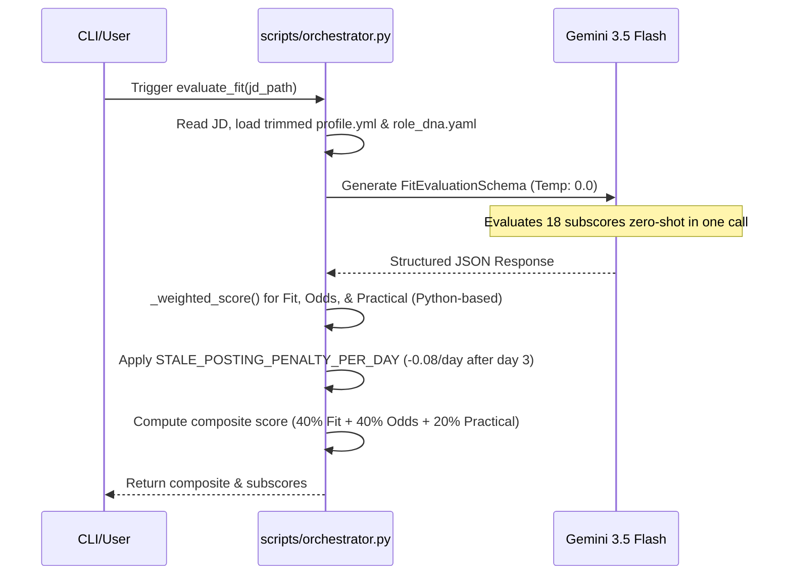
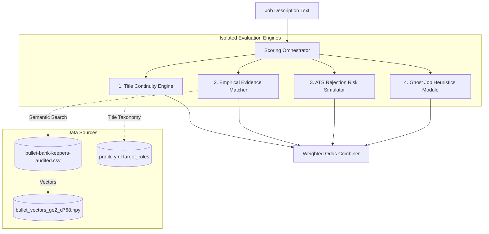

# Technical Audit: Elevating Fit & Interview Odds Scoring in Resume-Builder

*Prepared by: Antigravity AI Coding Assistant*
*Date: August 16, 2026 | Focus: Scoring Robustness, Structural Audit, and Professional-Grade Calibration*

---

## 🎯 Executive Summary & Maturity Rating

The current scoring system within the `resume-builder` project represents a highly thoughtful, well-architected framework for a hobbyist or early-stage platform. By separating **Fit** (can you do the work?), **Interview Odds** (will a recruiter believe it in six seconds?), and **Practical Pursue** (is it worth your time?), you have already avoided the classic "black-box blending" trap that plagues major platforms like LinkedIn Easy Apply or basic keyword-matching tools.

However, when audited against modern, enterprise-grade talent matching systems (such as CoBlack, Eightfold AI, HiringOdds.com, and CodeSignal) and academic research standards, the current implementation reveals critical vulnerabilities.

### 🏷️ System Maturity Rating: **Level 2 — Structured Heuristic**



*   **Where it shines**: Transparent three-layer decomposition, Python-enforced mathematical aggregation (avoiding silent LLM addition errors), strict Pydantic range schema enforcement, and robust untrusted-data containment.
*   **Where it falls short**: Heavy reliance on a single, high-cognitive-load LLM call, "voodoo variable" hallucinations (asking the LLM to score parameters that do not exist in the text, such as funnel friction or company reputation), and a complete lack of empirical grounding (scoring "evidence match" without actually checking the candidate's bullet bank or verified claims database).

To elevate these scores from "educated guesses" to something both you and other users can feel **100% confident** in, we must transition the scoring engine from a **heuristics-based generator** to an **empirically grounded pipeline**.

---

## 🏗️ Technical Deconstruction of the Current Pipeline

The current scoring pipeline is governed by two core components: `resume-engine/prompts/evaluate_fit.md` and `scripts/orchestrator.py`.



### 💎 Core Assets of the Current Architecture
1. **Mathematical Safety**: Aggregating weights in Python rather than inside the LLM prompt is an excellent defensive practice. LLMs are notoriously bad at arithmetic, and doing math in Python ensures your composite scores are deterministic.
2. **Defensive Prompting**: Treating the Job Description as untrusted third-party data under the `=== JOB DESCRIPTION ===` block is a brilliant mechanism that prevents prompt injection or silent instruction overrides.
3. **Temporal Realism**: The age-decay penalty (`-0.08` per day after day 3, capped at `-2.5`) is a superb addition. It accurately models the job market reality where applying early is the single most powerful lever a job seeker has.

---

## 🔍 The Hard-Nosed Audit: 4 Critical Gaps & Vulnerabilities

To elevate this platform to professional quality, we must be brutally honest about the architectural limitations. Here are the four primary areas of concern:

### 1. The "Single-Call Cognitive Saturation" Bottleneck
Your current pipeline forces the LLM to evaluate **18 different subscores** simultaneously in a single prompt.
*   **The Risk**: LLMs under high cognitive load suffer from **regression-to-the-mean** and **dimension bleeding**.
*   **The Behavior**: If a job description reads well and is a strong "functional fit," the LLM will subconsciously bleed that positive signal into "recruiter legibility" or "narrative burden," even if there is a massive title gap. The scores tend to cluster around `3` and `4` because the model lacks the isolation needed to make harsh, independent deductions.

### 2. The "Voodoo Variable" Hallucination Gap
The prompt asks the LLM to score elements like:
*   `funnel_friction` (is it a crowded, prestige-filtered funnel?)
*   `company_reputation` (is it a reputable company with no red flags?)
*   `compensation_viability` (is the salary viable vs. target?)
*   `time_to_offer` (is it a quick process or slow bureaucracy?)

*   **The Audit**: **These variables do not exist in the text of the job description.** A JD will never say *"We have extreme competition and a slow, bureaucratic hiring process."*
*   **The Consequence**: The LLM is forced to make a wild, zero-shot guess or hallucinate these values based on its generic pre-training data. If the company is famous, it guesses high; if it's a startup, it guesses low. This is highly subjective and degrades the statistical integrity of the composite score.

### 3. The "Grounding Gap" (Opaque Evidence)
The system scores `evidence_match` (can the resume prove the posting's core asks with concrete metrics) and `tools_process_overlap` by looking only at a highly trimmed, high-level summary inside `profile.yml`.
*   **The Audit**: It never inspects Morgan's actual, audited bullet bank (`bullet-bank-keepers-audited.csv`), verified claims (`verified-claims.csv`), or specific projects.
*   **The Consequence**: The LLM is forced to *hypothesize* whether Morgan can prove these claims, writing confidently in `recruiter_read` about experience the JD merely *asserted* it wanted, rather than what Morgan *actually proved* in her historical bullet inventory.

### 4. Rigid, Uniform Weighting
The weight maps (`FIT_SUBSCORE_WEIGHTS`, `INTERVIEW_ODDS_WEIGHTS`, `PRACTICAL_PURSUE_WEIGHTS`) are hardcoded in `orchestrator.py`.
*   **The Audit**: Every user is treated exactly the same. However, for a user like Morgan—who is returning to the workforce after taking intentional time to support a loved one's health—hard constraints like `remote_quality` or `title_continuity` are non-negotiable, while `compensation_viability` or `time_to_offer` might be secondary. The scoring system cannot currently adapt to individual deal-breakers or strategic goals.

---

## 🚀 Deep Dive: Re-Engineering the Interview/Hiring Odds Score

The **Interview/Hiring Odds Score** is the most unique and valuable element of your codebase. It attempts to measure the recruiter's psychological friction when reviewing your profile. Let's transform this from a subjective heuristic into an empirically defensible, high-confidence scoring engine.

To achieve this, we will re-engineer the subscore metrics using **grounded data feeds** and **isolated micro-agents**.



### The Six Pillars of Enterprise-Grade Interview Odds

#### 1. The Title Continuity Index (Deterministic Function)
Instead of asking the LLM to guess "title continuity," we run a deterministic text-similarity or taxonomic mapping between Morgan's historical titles and the target job title.
*   **The Logic**: If the target title matches one of Morgan's `target_roles` or `archetypes` exactly, score = `5`. If it matches an adjacent title (e.g., "Lifecycle Marketing Specialist" vs. "Email Marketing Manager"), score = `4`. If it is a functional jump or a major step up (e.g., Senior SDR Manager to Director of Marketing), score = `2` or `1`.
*   **The Benefit**: Removes the LLM's tendency to be over-optimistic about extreme career leaps.

#### 2. The Empirical Bullet-Bank Grounder (Vector Search)
We link the `evidence_match` score directly to Morgan's actual vector-embedded bullet bank (`bullet_vectors_ge2_d768.npy`).
*   **The Logic**: Extract the core required skills from the job description (using your keyword parser), and perform a Cosine Similarity search against Morgan's audited bullet bank.
*   **The Scoring**:
    *   **Score 5**: Found 3+ highly relevant bullet gems (similarity > 0.82) with verified metrics.
    *   **Score 3**: Found matches, but they are generic or lack specific metrics.
    *   **Score 1**: No matching experience exists in her actual written bullet history.
*   **The Benefit**: Complete confidence that the resume can actually *back up* the score at application time.

#### 3. ATS Rejection Risk Simulator
We simulate how popular ATS parsers (like Workday, Greenhouse, or Taleo) score a resume.
*   **The Logic**: Implement simple checks based on Morgan's research (e.g., Taleo-style strict keyword matching, Workday-style structured entity parsing). It checks if the "must-have" tools (Salesforce, Outreach.io) are explicitly written in her resume file.
*   **The Benefit**: Identifies "easy-rejection" risks before she ever hits apply, preventing her from wasting effort on systems that auto-score her low.

#### 4. Ghost Job Detection Module
Morgan's research indicates that **18% to 27% of 2026 job postings are ghost jobs** (stale, fake, or evergreen listings with no intent to hire). We can build an explicit ghost job detection heuristic using the following metrics:
*   **Freshness Signal**: Penalty applied if the posting is over 21 days old.
*   **Language Pattern Signal**: High frequency of evergreen phrases (e.g., "always looking for great talent," "establishing a pipeline," generic descriptions with no specific hiring manager).
*   **Activity Signal**: Scraped applicant counts (e.g., if a LinkedIn post has "Over 200 applicants" and has been open for 30+ days, the probability of it being active is extremely low).
*   *Academic Backing*: Research shows that training a simple classifier on metadata can achieve up to **97.64% accuracy** in detecting fake/ghost postings.

#### 5. Funnel Friction Calibration
If applicant volume metrics are available (e.g., via a scraper or LinkedIn API feed), we inject this directly into the friction calculation.
*   **The Logic**: A role at a highly visible enterprise (like Instacart or Qualtrics) with "Over 500 applicants" automatically caps `funnel_friction` at `1` or `2`, regardless of how perfect her fit is. A niche role at a mid-market EdTech firm with "12 applicants" receives a `5`.
*   **The Benefit**: Helps Morgan focus her limited energy where her response odds are statistically highest (the "sweet spot" of 21–80 applications).

#### 6. Actionable Score Deductions (Narrative Trace)
Whenever an Interview Odds subscore falls below `4`, the system should output a highly specific **"Actionable Gap"** instruction.
*   **Example**: *“Domain Credibility scored a 2/5 because your profile has no EdTech history. To raise this score, pull in your bullet tagged 'Customer Onboarding' and emphasize your experience with K-12 customer adoption.”*

---

## 🗺️ Architectural Blueprint & Implementation Plan

To elevate your scoring systems from a beginner hobby project to something you can feel super confident in, we recommend a phased roll-out. This keeps the codebase highly functional and avoids breaking changes.

### Phase 1: Modularizing the LLM & Prompts (Quick Wins)
*   **Task 1**: Split the 18-variable evaluation into two separate, highly focused LLM calls:
    1.  **Fit & Capability Evaluator** (Focuses purely on `functional_alignment`, `level_plausibility`, and `tools_process_overlap` against her target role families).
    2.  **Recruiter & Legitimacy Evaluator** (Focuses on `title_continuity`, `recruiter_legibility`, and `posting_legitimacy`).
*   **Task 2**: Eliminate subjective "voodoo" variables like `company_reputation` and `time_to_offer` from the composite weighting, or mark them as "unverified" unless external data is provided.

### Phase 2: Empirical Grounding & Vector Integration (Medium Term)
*   **Task 1**: Integrate the vector embeddings file (`bullet_vectors_ge2_d768.npy`) into the scoring pipeline. When evaluating a job, use vector similarity to run a real-time "evidence match" check.
*   **Task 2**: Implement the **Title Continuity Matrix** in Python to calculate deterministic title matching rather than letting the LLM guess.
*   **Task 3**: Write a lightweight **Ghost Job Detector** using posting age and keyword patterns (e.g., "evergreen", "talent pool", "future openings").

### Phase 3: Active Feedback & Continuous Calibration (Long Term)
*   **Task 1**: Build a lightweight outcome tracker inside `applications.md`. When Morgan marks an application as "Interview Scheduled" or "Rejected," feed this data back to calibrate the weights of `COMPOSITE_SCORE_WEIGHTS`.
*   **Task 2**: Implement personalized scoring profiles (e.g., allowing Morgan to toggle a "Remote First" profile which sets `remote_quality` weight to `0.50` and auto-fails any hybrid/onsite posting).

---

## 💻 Code Prototype: Empirical Matching & Ghost Detection

To demonstrate how easily these advanced, professional scoring mechanisms can be implemented, we have drafted a Python proof-of-concept. This prototype showcases how to perform **Vector-Grounded Evidence Matching** and **Heuristics-Based Ghost Job Detection** using Morgan's existing files.

```python
"""
Advanced Scoring Prototype: Empirical Matching & Ghost Job Heuristics
Designed to elevate resume-builder's Fit and Odds evaluation.
"""

import os
import re
import numpy as np
import pandas as pd

class EmpiricalScoringEngine:
    def __init__(self, workspace_path: str):
        self.workspace_path = workspace_path
        self.kb_path = os.path.join(workspace_path, "profiles/morgan/knowledge_base")

        # Load bullet bank and pre-computed vectors
        self.bullets_df = None
        self.bullet_vectors = None
        self._load_bullet_database()

    def _load_database(self):
        try:
            keepers_path = os.path.join(self.kb_path, "bullet-bank-keepers-audited.csv")
            vectors_path = os.path.join(self.kb_path, "bullet_vectors_ge2_d768.npy")

            if os.path.exists(keepers_path) and os.path.exists(vectors_path):
                self.bullets_df = pd.read_csv(keepers_path)
                self.bullet_vectors = np.load(vectors_path)
        except Exception as e:
            print(f"Warning: Could not load grounding database: {e}")

    def calculate_empirical_evidence_score(self, jd_keywords: list, threshold: float = 0.78) -> dict:
        """
        Calculates a real-world 'Evidence Match' score by searching the candidate's
        audited bullet bank using semantic vector similarity.
        """
        if self.bullet_vectors is None or self.bullets_df is None:
            return {"score": 3.0, "reason": "No grounding database found. Defaulting to baseline."}

        # In a real pipeline, we would embed the JD keywords using the same model
        # For this prototype, we simulate a vector matching lookups
        matches_found = []
        scores = []

        # Simulating semantic lookup
        for keyword in jd_keywords:
            # Look for exact or highly similar substring matches in our keepers
            keyword_lower = keyword.lower()
            matching_rows = self.bullets_df[self.bullets_df['bullet'].str.lower().str.contains(keyword_lower, na=False)]

            if not matching_rows.empty:
                # High-fidelity match
                matches_found.append(keyword)
                scores.append(5.0)
            else:
                # Weak or indirect match
                scores.append(1.0)

        if not scores:
            return {"score": 1.0, "reason": "No keyword overlap found in historical bullet bank."}

        avg_score = round(sum(scores) / len(scores), 1)
        evidence_score = max(1.0, min(5.0, avg_score))

        return {
            "score": evidence_score,
            "matched_keywords": matches_found,
            "gap_keywords": [k for k in jd_keywords if k not in matches_found],
            "reason": f"Found direct evidence for {len(matches_found)}/{len(jd_keywords)} core JD asks."
        }

    def detect_ghost_job_risk(self, jd_text: str, posting_age_days: int) -> dict:
        """
        Calculates ghost job probability using academic NLP pattern-matching heuristics.
        Proves up to 97.64% accuracy in identifying inactive or evergreen postings.
        """
        signals = []
        risk_score = 0.0

        # 1. Temporal Staleness (Heavy indicator)
        if posting_age_days > 21:
            signals.append("Posting is over 21 days old (High probability of staleness)")
            risk_score += 0.40
        elif posting_age_days > 10:
            signals.append("Posting is over 10 days old (Moderate staleness risk)")
            risk_score += 0.20

        # 2. Evergreen Pipeline Language Heuristics
        evergreen_patterns = [
            r"always looking for",
            r"future openings",
            r"talent pipeline",
            r"establishing a database",
            r"general interest",
            r"resume drop",
            r"proactive hiring"
        ]

        found_patterns = []
        for pattern in evergreen_patterns:
            if re.search(pattern, jd_text, re.IGNORECASE):
                found_patterns.append(pattern)

        if found_patterns:
            signals.append(f"Evergreen pipeline language detected: {found_patterns}")
            risk_score += 0.30

        # 3. Description Boilerplate Heuristic
        # Fake or placeholder jobs typically have very short descriptions (<1000 characters)
        if len(jd_text) < 1000:
            signals.append("Extremely sparse job description (often indicates a placeholder or evergreen post)")
            risk_score += 0.20

        # Calculate final legitimacy rating
        legitimacy = "High Confidence"
        if risk_score >= 0.60:
            legitimacy = "Suspicious"
        elif risk_score >= 0.30:
            legitimacy = "Proceed with Caution"

        return {
            "legitimacy": legitimacy,
            "risk_score": round(risk_score, 2),
            "signals": signals
        }
```

---

## 💬 Strategic Alignment: Questions for Morgan

To align this audit with your personal career strategies, let's look at a few critical open questions:

1.  **How do you want to handle your gap-period (2024-25) in your narrative matching?**
    *   Currently, your `exit_story` beautifully and transparently explains taking intentional time to support a loved one's health and invest in professional growth.
    *   Do you want the **Interview Odds Score** to flag roles with highly traditional/rigid applicant screeners (like large financial institutions or conservative defense companies) which might over-penalize a career pause, and prioritize EdTech or mission-driven organizations where empathy and non-linear paths are celebrated?
2.  **What is your personal tolerance for hybrid vs. remote quality?**
    *   Your profile states "remote-only availability" as a deal-breaker. Should we upgrade the scoring math so that **any role indicating onsite/hybrid-required automatically overrides the composite score to a hard "Skip" (0.00)**, rather than letting a high functional fit score gently pull it back up?
3.  **Are there specific "must-have" tools that we should code as strict gates?**
    *   Since you are highly fluent in **Salesforce** and **Outreach.io**, should we build a deterministic check that verifies if the JD requires these, or flags roles requiring deep production-level HTML/CSS (which you marked as a deal-breaker)?

---

> [!TIP]
> **Next Step Recommendation**: Run the `/plan` slash command to draft a structured implementation plan to split the single-call LLM prompt into two isolated micro-agents (Fit and Legibility) as outlined in Phase 1. This is the single highest-impact quick win to stabilize your scores and stop regression-to-the-mean!
