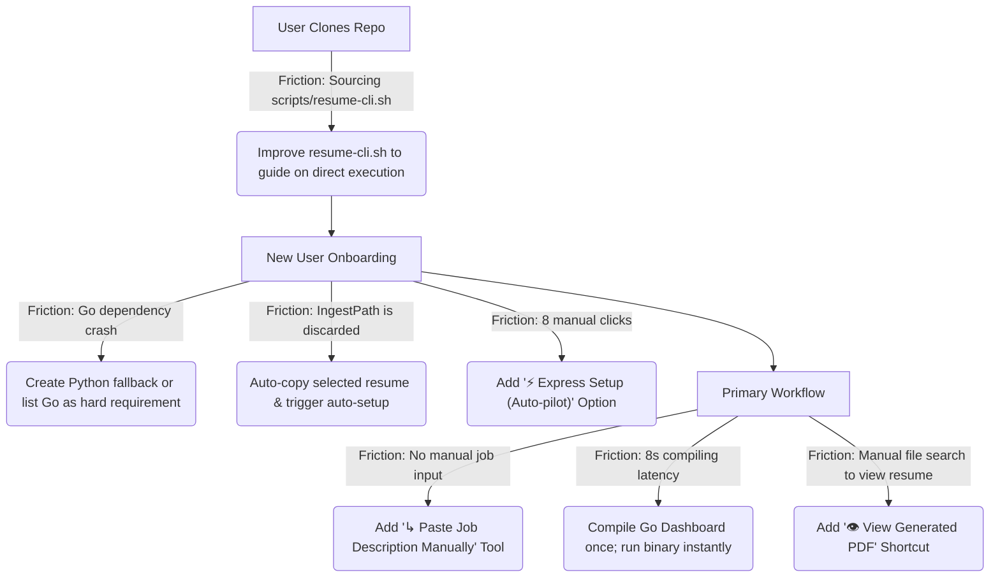

# User Experience & Interface Audit: resume-builder

This document presents a comprehensive UX/UI and Product Design evaluation of the `resume-builder` codebase. The audit is conducted through a dual lens: first, through the eyes of **"Taylor"** (a tech-savvy job seeker with ADHD who refuses to read documentation and expects software to be self-explanatory); and second, through the heuristic standards of high-end, production-grade terminal craftsmanship.

---

## 🎯 The Core Persona: Taylor
* **Tech-savvy but highly impatient:** Comfortable with the command line and terminal aesthetics, but has zero tolerance for friction.
* **Refuses to read the README:** Will clone the repo, immediately look for a launch script or run python on files, and expects the program to guide him.
* **ADHD Brain (Dopamine-driven):** Highly sensitive to silent delays (which feel like freezes) and repetitive manual workflows (which feel like chores). Thrives on immediate feedback, micro-animations, and instant gratification.
* **The "I told you about this, it's all yours" test:** Taylor is handed the repository folder with no prior context or explanation. 

---

## 🗺️ Heuristic Assessment Map

Below is a diagnostic scoring of the current user journey from cloning the repository to successfully applying for a job, mapping each stage to its UX severity score.

| Stage | Step | User Experience | Friction Level | Severity |
| :--- | :--- | :--- | :---: | :--- |
| **1. Inception** | Find how to launch the app | No `main.py` in root; executing `resume-cli.sh` directly exits silently with zero output. | 🎚️ High | 🔴 **Major Blocker** |
| **2. Wizard** | "New User? Start Here!" | Gorgeous Charm-based form asks for resume PDF, then silently discards it! | 🎚️ Extreme | 🔴 **Critical Bug** |
| **3. Dependencies**| Launching without Go | Onboarding crashes immediately with a Go compiler error, despite README calling Go "optional." | 🎚️ High | 🔴 **Major Blocker** |
| **4. Onboarding** | The 8-Stage Bootstrap | Slogging through 8 manual, slow sequential steps; no unattended auto-run. | 🎚️ Medium | 🟡 **Friction Point** |
| **5. Job Entry** | Adding job descriptions | No "Paste JD" tool. Taylor must write a strict, hand-formatted JSON file on disk. | 🎚️ Extreme | 🔴 **Major Blocker** |
| **6. Automation** | Scraping posting data | DevTools Copy-as-cURL cookie dance (goes stale); macOS Keychain master password prompts. | 🎚️ High | 🟡 **Friction Point** |
| **7. Dashboard** | Opening the Career Hub | `go run .` compiles Go code from scratch on *every launch*, causing a 3-8 second silent hang. | 🎚️ High | 🟡 **Friction Point** |
| **8. Output** | Viewing the tailored PDF | Build completes, prints file path, but provides no option to open or preview it. | 🎚️ Medium | 🟢 **Delight Opportunity** |

---

## 🔍 Deep Dive: The 8 Friction Points & How to Fix Them

### 1. The Direct Shell Script Execution Trap (The Silent Exit)
> [!WARNING]
> **What Taylor does:** Clones the repository, enters the folder, sees `scripts/resume-cli.sh`, and runs `./scripts/resume-cli.sh`.
>
> **What happens:** **Absolutely nothing.** The terminal prints zero output, doesn't start any program, and exits instantly. 
>
> **Why it happens:** `resume-cli.sh` is written to be *sourced* (`source scripts/resume-cli.sh`) to inject the `resume` function into the active shell. Sourcing is a developer-centric concept. To an impatient user, running a shell script directly and getting absolute silence means: *"This program is broken."* They will delete the folder and give up.
>
> **The Fix:** Detect when the script is being executed directly rather than sourced, and print a clear, friendly, colored instruction block teaching the user how to source it or launch the python script directly.
> ```bash
> if [[ "${BASH_SOURCE[0]}" == "${0}" ]]; then
>   echo "✦ resume-builder CLI shortcut ✦"
>   echo "To install the 'resume' command, source this script in your shell:"
>   echo "  source $(pwd)/scripts/resume-cli.sh"
>   echo ""
>   echo "Or, run the interactive menu directly:"
>   echo "  python3 scripts/cli.py"
>   exit 0
> fi
> ```

---

### 2. The Ghost Resume (The Discarded File-Picker Inputs)
> [!CAUTION]
> **What Taylor does:** Launches "New User? Start Here!". A beautiful Charm-based terminal wizard greets him, asking for his profile name and featuring a robust file browser where he searches his home directory, selects `Taylor_Resume_2026.pdf`, and hits Enter. He confirms "Build the bullet-bank now? [Yes]".
>
> **What happens:** The wizard exits and drops him into a second menu titled "Onboarding Progress." Step 0 says: **`Never run: no source documents uploaded yet`**. If he clicks Step 0, it tells him: *"Go to profiles/taylor/knowledge_base/bootstrap/source_documents and drop in your resume."* 
> 
> **Why it happens:** This is a major structural gap. The Go onboarding binary (`dashboard/cmd/bootstrap`) collects the `SourceChoice` and `IngestPath`, but the Python menu wrapper (`scripts/menu.py` inside `_handle_bootstrap()`) **only reads the `profile_name`** from the returned JSON! It completely discards the selected file path and the "Build bullet-bank" confirmation! The user's effort to browse and select their resume is treated as a ghost interaction.
>
> **The Fix:** Update the Python menu wrapper `_handle_bootstrap()` in `scripts/menu.py` to check for `ingest_path`. If present, it should automatically copy that file into the newly-scaffolded profile's `source_documents/` folder. If `create_bullet` is true, it should immediately trigger the ingestion and bootstrap pipeline automatically.
> ```python
> # Proposed Python integration
> source_path = data.get("ingest_path")
> if source_path and os.path.exists(source_path):
>     dest_dir = os.path.join(profile_paths.kb_dir(name), "bootstrap", "source_documents")
>     shutil.copy(source_path, dest_dir)
> ```

---

### 3. The Go Dependency Fallacy
> [!IMPORTANT]
> **What Taylor does:** Reads (or skims) enough to see that Python and Node are required. Skips Go because the README says: *"Optional, only needed for `resume dashboard`: install Go."* He launches `python3 scripts/cli.py` and hits Enter on `New User? Start Here!`.
>
> **What happens:** The program crashes instantly with a friendly (but frustrating) subprocess error telling him Go is not installed.
>
> **Why it happens:** The onboarding "New User" flow is built on a Go binary (`go run ./dashboard/cmd/bootstrap`). This means **Go is NOT optional for a new user** who wants to set up a profile through the interactive terminal menu. It is an absolute, hard blocker on the very first button click.
>
> **The Fix:** 
> * **Option A (Aesthetic preservation):** Update the README to declare Go as a **required** dependency for the interactive terminal experience.
> * **Option B (Graceful fallback):** If Go is missing, instead of crashing, fall back to a simple, terminal-native Python-based questionary prompt to collect the profile name and bootstrap the directories.

---

### 4. The 8-Stage Sequential Slog (The ADHD Attention Tax)
> [!WARNING]
> **What Taylor does:** Finishes Step 0. He is faced with a progress checklist of 8 distinct phases (0, 0.5, 1, 2, 3, 4, 5, 6).
>
> **What happens:** He has to manually select Step 0, wait for Ingestion (Gemini calls), return to the menu, select Step 0.5, wait (more Gemini calls), return to the menu, select Step 1, wait (Audit), and so on.
>
> **Why it happens:** The onboarding wizard is highly granular and designed for deep customization, but it forces an active "click-wait-click" cycle on the user. For a user with ADHD, this is a massive cognitive tax. They will get distracted by a browser tab during Step 1's audit, completely forget about the terminal, and never finish the setup.
>
> **The Fix:** Add a prominent **"⚡ Express Setup (Auto-pilot)"** option at the top of the onboarding menu. This option should chain all 8 steps together sequentially in a single execution thread, showing a unified progress bar, allowing Taylor to walk away, grab a coffee, and return to a fully-formed profile and bullet-bank. (The codebase already supports this via `python bootstrap_bullet_bank.py --yes`, but it is completely hidden from the interactive TUI menu!).

---

### 5. The Missing "Paste JD" Portal
> [!IMPORTANT]
> **What Taylor does:** Finds a cool job description on a company site, a private email, or a job board like Indeed. He wants to quickly tailor a resume for it. He goes to the "Find Jobs" menu.
>
> **What happens:** He sees: "Scan for New Jobs", "Check Liveness", "Evaluate Pending", "Archive Stale". There is **no option** to simply paste or type a job description.
>
> **Why it happens:** The system is heavily optimized for bulk automation and scrapers (which is amazing for scaling). However, it leaves individual, manual JDs in the cold. To tailor a manual JD, Taylor has to manually write a JSON file with keys like `job_title`, `company_name`, and `description`, and save it to `profiles/taylor/jds/pending/my-job.json`. *No job seeker is going to do this.*
>
> **The Fix:** Add a **"↳ Paste/Add Job Description Manually"** option under the "Find Jobs" submenu. It should present:
> 1. An input for **Job Title** (required).
> 2. An input for **Company Name** (required).
> 3. An input for **Source URL** (optional).
> 4. A multi-line text area or editor window to paste the raw **Job Description text**.
> The program then packages this into the correct JSON format and saves it directly to `jds/pending/`, making it instantly ready to evaluate or tailor.

---

### 6. The Automation Friction (Cookies and Keychain Prompts)
> [!WARNING]
> **What Taylor does:** Tries to use the automatic scrapers. Selects "Scan for New Jobs" and chooses LinkedIn or JobRight.
>
> **What happens:** 
> * **For LinkedIn:** The script uses `browser_cookie3` to read cookies from his local Chrome. On macOS, this triggers a scary, native system Keychain prompt asking for his master password. 
> * **For JobRight:** It demands a `JOBRIGHT_COOKIE_STRING` in his `.env`, requiring him to open DevTools, inspect the network tab, copy a request as a cURL command, paste it into an editor, and extract the cookie string.
>
> **Why it happens:** Modern security protocols make cookie extraction hard. On macOS, Chrome's safe storage is encrypted inside the System Keychain.
>
> **The UX Impact:** 
> * The macOS Keychain prompt is highly alarming; many users will deny it out of security hygiene, causing the script to throw a traceback and crash.
> * The JobRight cURL dance is a massive barrier for an ADHD user; the moment they see instructions containing "Open DevTools and copy as cURL", they will close the app.
>
> **The Fix:**
> * **For LinkedIn:** Prior to triggering `browser_cookie3`, print a clean, reassuring terminal card explaining *why* macOS is about to ask for their password (to read the active browser session) and that the program never stores or sends this password.
> * **For JobRight:** Introduce a lightweight helper script/prompt that lets the user simply paste the raw cURL command, and the program parses out the cookie and updates the `.env` file for them.

---

### 7. The Silent Compiled Hang (Dashboard Compiler Latency)
> [!WARNING]
> **What Taylor does:** Clicks "Career Dashboard" or "Browse & Manage Jobs" to check his application statuses.
>
> **What happens:** The terminal goes completely silent and empty for **5 to 8 seconds** before finally rendering the TUI dashboard. 
>
> **Why it happens:** The career dashboard is a Go TUI. Every single time the user opens it, Python executes `go run .`. This compiles the entire Go application from source on the fly. 5-8 seconds of a frozen terminal is a lifetime to an ADHD brain—it feels like the program crashed.
>
> **The Fix:** Compile the Go dashboard to a binary (e.g., `dashboard/bin/dashboard`) **once** during the bootstrapping/install phase (or compile it on the first run and cache the binary). On subsequent launches, check if the binary exists and execute it directly.
> * **Instant launch:** Running a compiled binary takes **0.01 seconds** instead of 8 seconds. This turns a sluggish, laggy handoff into an instantaneous, premium-feeling transition.

---

### 8. The Blind Render Output (The Missing Feedback Loop)
> [!TIP]
> **What Taylor does:** Runs a successful tailor/build. He watches the terminal audit bullets, match tags, and print: `✦ Success: PDF written to output/taylor/Google_Software_Engineer.pdf`.
>
> **What happens:** The program asks: "Choose one: Show Help, Return to Main Menu, Exit". To actually *see* the resume he just spent minutes building, Taylor has to open Finder, navigate to his user folder, find the project directory, click through `output`, click `taylor`, and open the PDF.
>
> **Why it happens:** The terminal pipeline stops at compilation. It doesn't close the loop by helping the user *consume* the artifact.
>
> **The Fix:** In the "What's Next?" menu, if a PDF was successfully generated, insert an instant action at the very top:
> **`👁️  View Generated PDF`**
> Selecting this should execute `open <pdf_path>` on macOS (or the system-equivalent open command), instantly launching Preview/Acrobat so the user gets an immediate, satisfying visual confirmation of their work.

---

## 🛠️ Summary of Recommended Adjustments



### High-Impact, Low-Effort Quick Wins
1. **Un-discard Wizard Inputs:** Fix the Python menu wrapper to honor the Go wizard's `IngestPath` and `CreateBullet` variables. This instantly removes the confusing "Step 0" empty-state barrier.
2. **Instant Open:** Add the `open <pdf_path>` action to the "What's Next?" menu. This short-circuits the workflow and provides instant gratification.
3. **Compile the Dashboard:** Switch `scripts/dashboard.py` from `go run .` to executing a pre-compiled binary. This removes the 8-second compiling delay and makes the TUI feel blazingly fast.
4. **Paste JD Option:** Add a text prompt to ingest manual job descriptions, removing the requirement to write custom JSON files.
