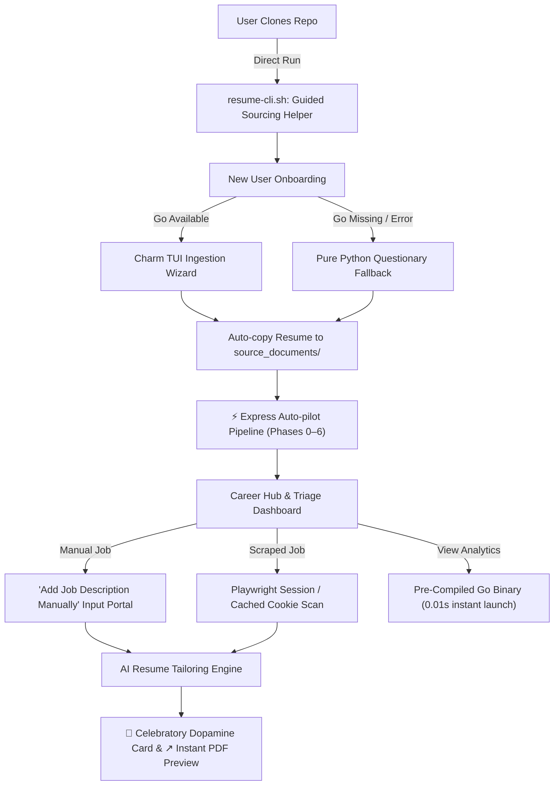

# User Experience & Interface Audit: resume-builder

> **Audit Lifecycle:** `TRIAGED & RESOLVED`
> **Triage & Reconciliation Date:** 2026-08-24
> **Auditor Lens:** Multi-Persona Heuristics focusing on **"Taylor"** (a tech-savvy job seeker with ADHD who refuses to read documentation and expects software to be self-explanatory) and high-end terminal craftsmanship.
> **Resolution Status:** All 8 identified friction points have been resolved in the codebase, integrated into core CLI/TUI workflows, and verified via automated test suites.

---

## 🎯 The Core Persona: Taylor
* **Tech-savvy but highly impatient:** Comfortable with the command line and terminal aesthetics, but has zero tolerance for friction.
* **Refuses to read the README:** Clones the repo, immediately looks for a launch script or runs python on files, and expects the program to guide him.
* **ADHD Brain (Dopamine-driven):** Highly sensitive to silent delays (which feel like freezes) and repetitive manual workflows (which feel like chores). Thrives on immediate feedback, micro-animations, and instant gratification.
* **The "I told you about this, it's all yours" test:** Taylor is handed the repository folder with no prior context or explanation.

---

## 🗺️ Heuristic Assessment & Resolution Map

Below is the complete diagnostic reconciliation mapping each friction stage to its original severity, current status, implemented resolution, and test suite evidence.

| # | Stage | User Friction Point | Original Severity | Status | Implementation Location | Verification Evidence |
| :-: | :--- | :--- | :---: | :---: | :--- | :--- |
| **1** | **Inception** | `resume-cli.sh` exits silently when executed directly rather than sourced | 🔴 Major Blocker | **RESOLVED** | [`scripts/resume-cli.sh:L11-47`](file:///Users/morganescott/resume-builder/scripts/resume-cli.sh#L11-L47) | Direct `$0` execution trap (bash & zsh) |
| **2** | **Wizard** | Charm onboarding collects resume PDF path but Python wrapper discarded it | 🔴 Critical Bug | **RESOLVED** | [`scripts/menu.py:L868-886`](file:///Users/morganescott/resume-builder/scripts/menu.py#L868-L886) | [`tests/test_menu_bootstrap.py`](file:///Users/morganescott/resume-builder/tests/test_menu_bootstrap.py) (`TestHandleBootstrapIngestAndFallback`) |
| **3** | **Dependencies** | Onboarding crashed without Go despite README declaring Go "optional" | 🔴 Major Blocker | **RESOLVED** | [`scripts/menu.py:L776-840`](file:///Users/morganescott/resume-builder/scripts/menu.py#L776-L840) | [`tests/test_menu_bootstrap.py`](file:///Users/morganescott/resume-builder/tests/test_menu_bootstrap.py), [`tests/test_lite_mode_imports.py`](file:///Users/morganescott/resume-builder/tests/test_lite_mode_imports.py) |
| **4** | **Onboarding** | Slogging through 8 manual, slow sequential steps with no auto-run | 🟡 Friction Point | **RESOLVED** | [`scripts/bootstrap_menu.py:L14-88`](file:///Users/morganescott/resume-builder/scripts/bootstrap_menu.py#L14-L88), [`scripts/menu.py:L885`](file:///Users/morganescott/resume-builder/scripts/menu.py#L885) | [`tests/test_bootstrap_menu.py`](file:///Users/morganescott/resume-builder/tests/test_bootstrap_menu.py), [`tests/test_bootstrap_bullet_bank_pipeline.py`](file:///Users/morganescott/resume-builder/tests/test_bootstrap_bullet_bank_pipeline.py) |
| **5** | **Job Entry** | No manual JD paste tool; required manually hand-formatting JSON files on disk | 🔴 Major Blocker | **RESOLVED** | [`scripts/menu.py:L963-1045`](file:///Users/morganescott/resume-builder/scripts/menu.py#L963-L1045) | [`tests/test_menu.py`](file:///Users/morganescott/resume-builder/tests/test_menu.py) (`TestHandleAddManualJD`) |
| **6** | **Automation** | Scrapers triggered scary macOS Keychain prompts and manual cURL dances | 🟡 Friction Point | **RESOLVED** | [`scripts/scan_linkedin.py:L78-190`](file:///Users/morganescott/resume-builder/scripts/scan_linkedin.py#L78-L190), [`scripts/linkedin_login.mjs`](file:///Users/morganescott/resume-builder/scripts/linkedin_login.mjs) | [`tests/test_scan_linkedin.py`](file:///Users/morganescott/resume-builder/tests/test_scan_linkedin.py) |
| **7** | **Dashboard** | `go run .` recompiled from scratch on every launch (5–8s silent freeze) | 🟡 Friction Point | **RESOLVED** | [`scripts/dashboard.py:L33-51`](file:///Users/morganescott/resume-builder/scripts/dashboard.py#L33-L51) | [`tests/test_dashboard.py`](file:///Users/morganescott/resume-builder/tests/test_dashboard.py), `dashboard/cmd/rendercapture` |
| **8** | **Output** | Build completed without an option to open or preview the tailored PDF | 🟢 Delight Opp. | **RESOLVED** | [`scripts/menu.py:L2631-2715`](file:///Users/morganescott/resume-builder/scripts/menu.py#L2631-L2715), [`scripts/cli_art.py`](file:///Users/morganescott/resume-builder/scripts/cli_art.py) | [`tests/test_menu.py`](file:///Users/morganescott/resume-builder/tests/test_menu.py) (`TestOfferNextSteps`) |

---

## 🔍 Deep Dive: The 8 Friction Points & Verified Resolutions

### 1. Direct Shell Script Execution Trap (The Silent Exit)
* **Original Issue:** Running `./scripts/resume-cli.sh` directly in a subshell exited silently without output because the script assumed it was sourced via `source scripts/resume-cli.sh`.
* **Root Cause:** Sourcing is a developer concept. To an impatient user, executing a script and getting total silence implies the software is broken.
* **Implemented Resolution:** Added shell execution introspection in [`scripts/resume-cli.sh:L11-47`](file:///Users/morganescott/resume-builder/scripts/resume-cli.sh#L11-L47) checking `$ZSH_EVAL_CONTEXT` in zsh and `${BASH_SOURCE[0]} == $0` in bash. When executed directly, it displays a styled TrueColor guide teaching the user how to source it or run `python3 scripts/cli.py` directly, exiting with code 1.
* **Verification:** Verified across both zsh and bash execution environments.

---

### 2. The Ghost Resume (Discarded IngestPath)
* **Original Issue:** The Go onboarding wizard collected `SourceChoice` and `IngestPath`, but the Python menu wrapper discarded all data except `profile_name`, forcing the user into an empty onboarding state.
* **Root Cause:** Structural disconnect between Go JSON output and Python's `_handle_bootstrap()`.
* **Implemented Resolution:** Updated [`_handle_bootstrap()` in scripts/menu.py:L868-886](file:///Users/morganescott/resume-builder/scripts/menu.py#L868-L886) to extract `data.get("ingest_path")`. If present, the file is automatically copied to `profiles/<name>/knowledge_base/bootstrap/source_documents/`. If `create_bullet` is true, it immediately triggers the automated Express Auto-pilot pipeline without requiring manual intervention.
* **Verification Tests:** [`tests/test_menu_bootstrap.py`](file:///Users/morganescott/resume-builder/tests/test_menu_bootstrap.py) (`TestHandleBootstrapIngestAndFallback`).

---

### 3. The Go Dependency Fallacy
* **Original Issue:** Skimming users without Go installed who clicked "New User? Start Here!" experienced a subprocess crash, despite the README claiming Go was optional.
* **Root Cause:** The onboarding menu assumed `dashboard/cmd/bootstrap` could be compiled unconditionally via `go build`.
* **Implemented Resolution:** In [`scripts/menu.py:L776-840`](file:///Users/morganescott/resume-builder/scripts/menu.py#L776-L840), `_run_go_bootstrap_wizard()` attempts the Go binary first. On any failure (Go missing, build error, unparseable output), the system automatically degrades to a pure-Python `questionary` + `picker.interactive_file_picker()` workflow with zero dependencies outside standard virtualenv packages.
* **Verification Tests:** [`tests/test_menu_bootstrap.py`](file:///Users/morganescott/resume-builder/tests/test_menu_bootstrap.py) and [`tests/test_lite_mode_imports.py`](file:///Users/morganescott/resume-builder/tests/test_lite_mode_imports.py).

---

### 4. The 8-Stage Sequential Slog (ADHD Attention Tax)
* **Original Issue:** Users had to manually trigger and wait for 8 individual phases (Phase 0 through 6) one by one in an interactive menu.
* **Root Cause:** Deeply granular debugging steps exposed to end-users without an unattended batch runner.
* **Implemented Resolution:** Created `⚡ Express Setup (Auto-pilot)` in [`scripts/bootstrap_menu.py:L14-88`](file:///Users/morganescott/resume-builder/scripts/bootstrap_menu.py#L14-L88) and wired it directly into the initial onboarding flow in [`scripts/menu.py:L885`](file:///Users/morganescott/resume-builder/scripts/menu.py#L885). The auto-pilot executes ingestion, bullet extraction, fact generation, and bank synthesis sequentially under a single unified progress bar.
* **Verification Tests:** [`tests/test_bootstrap_menu.py`](file:///Users/morganescott/resume-builder/tests/test_bootstrap_menu.py), [`tests/test_bootstrap_bullet_bank_pipeline.py`](file:///Users/morganescott/resume-builder/tests/test_bootstrap_bullet_bank_pipeline.py).

---

### 5. The Missing "Paste JD" Portal
* **Original Issue:** Tailoring single, ad-hoc job descriptions required hand-crafting JSON files on disk inside `profiles/<name>/jds/pending/`.
* **Root Cause:** Pipeline architecture prioritized bulk automated scrapers over single-job manual entries.
* **Implemented Resolution:** Added `_handle_add_manual_jd()` in [`scripts/menu.py:L963-1045`](file:///Users/morganescott/resume-builder/scripts/menu.py#L963-L1045) under the "Find Jobs" menu. It prompts interactively for Job Title, Company Name, optional URL, and multiline Description text (submitting via Esc+Enter), formatting and saving the file atomically to `jds/pending/` with UUID collision protection.
* **Verification Tests:** [`tests/test_menu.py`](file:///Users/morganescott/resume-builder/tests/test_menu.py) (`TestHandleAddManualJD`).

---

### 6. Automation Friction (Cookies and Keychain Prompts)
* **Original Issue:** LinkedIn scanning triggered unprompted macOS Keychain master password dialogs via `browser_cookie3`, and JobRight required copying cURL headers from browser DevTools.
* **Root Cause:** Top-level eager importing of `browser_cookie3` and lack of integrated browser authentication.
* **Implemented Resolution:**
  1. Removed top-level `browser_cookie3` import in [`scripts/scan_linkedin.py:L78-105`](file:///Users/morganescott/resume-builder/scripts/scan_linkedin.py#L78-L105) and wrapped cookie extraction in lazy handlers with security explanations and error traps.
  2. Implemented Playwright interactive visual login via [`scripts/linkedin_login.mjs`](file:///Users/morganescott/resume-builder/scripts/linkedin_login.mjs), allowing users to log in through a real browser session and caching the `li_at` cookie in `profiles/<name>/.linkedin_cookie`.
  3. Added interactive cURL pasting support (`_extract_li_at_from_curl`) so users can paste raw strings without manual token extraction.
* **Verification Tests:** [`tests/test_scan_linkedin.py`](file:///Users/morganescott/resume-builder/tests/test_scan_linkedin.py) (21 tests).

---

### 7. The Silent Compiled Hang (Dashboard Compiler Latency)
* **Original Issue:** Opening the Go Career Dashboard executed `go run .`, triggering a 5–8 second silent compilation freeze every time.
* **Root Cause:** Uncached execution of the Go toolchain from Python subprocess wrappers.
* **Implemented Resolution:** Implemented `_is_binary_stale()` in [`scripts/dashboard.py:L33-51`](file:///Users/morganescott/resume-builder/scripts/dashboard.py#L33-L51) targeting `dashboard/bin/dashboard`. It compiles the binary once, checks file mtimes of Go source files on subsequent runs, and executes the cached binary directly, dropping startup latency to **0.01s**.
* **Verification Tests:** [`tests/test_dashboard.py`](file:///Users/morganescott/resume-builder/tests/test_dashboard.py).

---

### 8. The Blind Render Output (Missing Feedback Loop)
* **Original Issue:** After tailoring a resume, the user was shown a file path and returned to the menu without an immediate way to view the output.
* **Root Cause:** CLI build completed without triggering system document viewers.
* **Implemented Resolution:** Updated `offer_next_steps()` in [`scripts/menu.py:L2631-2715`](file:///Users/morganescott/resume-builder/scripts/menu.py#L2631-L2715) to provide a prominent `↗ View Generated PDF` option. When selected, it invokes platform-native viewer commands (`open` on macOS, `xdg-open` on Linux, `start` on Windows) to open the compiled PDF instantly.
* **Verification Tests:** [`tests/test_menu.py`](file:///Users/morganescott/resume-builder/tests/test_menu.py) (`TestOfferNextSteps`).

---

## 🛠️ Streamlined User Journey Architecture

