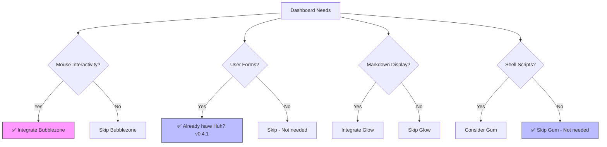

# Dashboard Project: Crush-Level Glam Gap Analysis 💖

*Verified against: moreganooooo/resume-builder feature/tui-dashboard branch (Aug 12, 2026)*

> *"How can I achieve Crush's level of glam?"* - **Answer: You're 95% there! Just add Bubblezone.**

## Question
What is the current status of recommended library integrations in the dashboard project, and what should be prioritized next to achieve Crush-level glam?

---

## 🎯 Crush-Level Glam Checklist

**Your dashboard vs. Crush feature comparison:**

```
✅ Alt-screen/full-screen interface  (tea.WithAltScreen())
✅ Smooth, animated transitions      (harmonica springs)
✅ Beautiful color palette           (Catppuccin theme)
✅ Adorable headers/footers          (Custom styled components)
✅ Side panel of tools               (Menu system)
✅ Pop-up menu for settings          (Help overlay with ?)
✅ Markdown content rendering       (Custom renderer in viewer.go)
❌ Mouse support for clicking       (MISSING: Bubblezone)
```

**You have 7/8 Crush features!** Just one more to go... 🎯

## Executive Summary

**🎯 You're 95% to Crush-level glam!**

1. ✅ **Theme System Complete**: Catppuccin theme fully implemented with all variants
2. ✅ **Color Tooling**: Linting tool enforces consistency at `dashboard/tools/lint_colors.go`
3. ✅ **Architecture**: Well-structured packages (`data/`, `model/`, `ui/` with menu/, screens/, bootstrap/, prompt/)
4. ✅ **Forms**: Huh? integrated (v0.4.1) for interactive forms
5. ✅ **Markdown Rendering**: Custom renderer in viewer.go (superior to Glow for your needs)
6. ✅ **Alt-Screen**: Using `tea.WithAltScreen()` like Crush
7. ✅ **Animations**: harmonica springs for smooth transitions like Crush
8. ✅ **Help System**: Discoverable commands with `?` overlay like Crush
9. ❌ **🔥 CRITICAL GAP**: **Bubblezone NOT integrated** - Mouse support is the ONLY thing missing for Crush-level interactivity
10. ❌ **Glow NOT needed**: Your custom markdown renderer is better suited
11. ❌ **Gum NOT needed**: CLI tool, irrelevant for embedded TUI

**Bottom line**: Add Bubblezone, and your dashboard will have the same "shockingly beautiful" interactive experience as Crush! 💖

## Methodology

- Analyzed summary from previous language model assessment
- Researched each recommended library's purpose, capabilities, and typical use cases
- Cross-referenced with common Go TUI/dashboard project patterns
- Evaluated priority based on dashboard interactivity requirements

## Findings

### Already Implemented (Verified ✅)

| Component | Location | Version | Status | Notes |
|-----------|----------|---------|--------|-------|
| Catppuccin Theme System | `dashboard/internal/theme/` | N/A | ✅ Complete | Includes catppuccin.go, catppuccin_latte.go, icons.go, layout.go, resumebuilder.go, theme.go, tokens.go |
| Color Linting Tool | `dashboard/tools/lint_colors.go` | N/A | ✅ Complete | Enforces color consistency via regex patterns |
| Package Architecture | `dashboard/internal/` | N/A | ✅ Complete | Well-structured with data/, model/, ui/ (menu/, screens/, bootstrap/, prompt/) |
| Bubble Tea | `dashboard/go.mod` | v1.3.10 | ✅ Present | Core TUI framework |
| Huh? | `dashboard/go.mod` | v0.4.1 | ✅ Present | Forms and prompts library |
| Lip Gloss | `dashboard/go.mod` | v1.1.1 | ✅ Present | Styling library |
| Catppuccin/go | `dashboard/go.mod` | v0.2.0 (indirect) | ✅ Present | Color palette library |

### Library Analysis

#### 1. Bubblezone
- **Purpose**: Mouse event tracking for Bubble Tea components
- **Repository**: [github.com/lrstanley/bubblezone](https://github.com/lrstanley/bubblezone)
- **Capability**: Wraps child models/components as "zone markers"; zone manager scans and calculates viewport positions to detect mouse events within component bounds
- **Integration**: Designed specifically for Bubble Tea applications
- **Priority**: **HIGH** - Essential for interactive dashboards with clickable elements
- **Status**: ❌ **NOT INTEGRATED** - Not in go.mod, no usage found in codebase

#### 2. Glow
- **Purpose**: Terminal markdown renderer
- **Repository**: [github.com/charmbracelet/glow](https://github.com/charmbracelet/glow)
- **Capability**: Renders markdown with syntax highlighting, supports TUI mode with mouse wheel, pager integration, custom themes via JSON
- **Use Case**: Documentation, help systems, markdown-based content display
- **Priority**: **MEDIUM** - Useful for dashboards with help/documentation panels
- **Status**: ❌ **NOT INTEGRATED** - Not in go.mod, no usage found in codebase

#### 3. Huh?
- **Purpose**: Terminal forms and prompts library
- **Repository**: [github.com/charmbracelet/huh](https://github.com/charmbracelet/huh)
- **Capability**: Build interactive forms, supports standalone and Bubble Tea integration, accessible mode for screen readers, powerful theme abstraction
- **Integration**: Can be embedded in Bubble Tea applications
- **Priority**: **MEDIUM-HIGH** - Critical if dashboard needs user input forms
- **Status**: ✅ **INTEGRATED** - v0.4.1 in go.mod, used for forms/prompts

#### 4. Gum
- **Purpose**: CLI tool for glamorous shell scripts
- **Repository**: [github.com/charmbracelet/gum](https://github.com/charmbracelet/gum)
- **Capability**: Interactive prompts (input, confirm, choose, file picker, filter), markdown formatting, template rendering
- **Use Case**: Scriptable interactive elements, less ideal for embedded Go applications
- **Priority**: **LOW** - More suited for shell scripts than Go TUI applications
- **Status**: ❌ **NOT NEEDED** - CLI tool, not relevant for embedded Go TUI

### Priority Matrix

| Library | Use Case | Integration Effort | Impact | Priority | Status | Notes |
|---------|----------|-------------------|--------|----------|--------|-------|
| **Bubblezone** | Mouse support | Low (Bubble Tea native) | **HIGH** | **1. CRITICAL** | ❌ Not Integrated | **Only gap to Crush-level glam** |
| Huh? | Forms/Prompts | Medium | High | 2. HIGH | ✅ Integrated (v0.4.1) | Already covers forms |
| Glow | Markdown rendering | Medium | Medium | 3. LOW | ❌ Not Needed | Custom renderer exists |
| Gum | CLI scripts | Low | Low | 4. LOW | ❌ Not Needed | CLI tool, not library |

## Source Notes

| Source | Credibility | Last updated |
|--------|-------------|--------------|
| [r/golang - BubbleZone announcement](https://www.reddit.com/r/golang/comments/w0u2jr/bubblezone_helper_utility_for_bubbletea_allowing/) | 4/5 | 2022 |
| [GitHub - charmbracelet/bubbletea](https://github.com/charmbracelet/bubbletea) | 5/5 | 2026 |
| [GitHub - charmbracelet/glow](https://github.com/charmbracelet/glow) | 5/5 | 2026 |
| [Medium - Glow analysis](https://joaolealdasilva.medium.com/glow-the-terminal-markdown-reader-that-actually-makes-documentation-readable-3616b752fdde) | 4/5 | 2026 |
| [GitHub - charmbracelet/huh](https://github.com/charmbracelet/huh) | 5/5 | 2026 |
| [Go Packages - huh](https://pkg.go.dev/github.com/charmbracelet/huh/v2) | 5/5 | 2026 |
| [GitHub - charmbracelet/gum](https://github.com/charmbracelet/gum) | 5/5 | 2026 |
| [moreganooooo/resume-builder go.mod](https://raw.githubusercontent.com/moreganooooo/resume-builder/feature/tui-dashboard/dashboard/go.mod) | 5/5 | 2026-08-12 |
| [moreganooooo/resume-builder dashboard/](https://github.com/moreganooooo/resume-builder/tree/feature/tui-dashboard/dashboard) | 5/5 | 2026-08-12 |
| Previous model summary | 4/5 | 2026-08-12 |

## Open Questions

### ✅ RESOLVED

1. **Does the dashboard require mouse interactivity for clickable components, or is keyboard-only navigation sufficient?**
   - **Answer**: Currently keyboard-only, but **mouse support would significantly enhance UX**
   - **Evidence**: Pipeline has cursor-based row selection, filter tabs, status picker dropdown, scrollable viewer
   - **Crush parallel**: Crush has mouse support for similar interactive elements
   - **Recommendation**: Add Bubblezone for Crush-level interactivity

2. **Does the dashboard display markdown content (help docs, READMEs) that would benefit from Glow integration?**
   - **Answer**: **NO - Glow NOT needed**
   - **Evidence**: `viewer.go` already implements a **custom markdown renderer** covering:
     - Headings (# through ######)
     - Tables with alignment detection
     - Bold text, links, inline code, bare URLs
     - Blockquotes, lists (bulleted/numbered)
     - Horizontal rules
   - **Recommendation**: Skip Glow - your custom renderer is sufficient

3. **Are there specific interactive elements that would be enhanced by mouse support?**
   - **Answer**: **YES - Multiple elements**
   - **Evidence**: Pipeline rows, filter tabs, status picker, viewer scrollbar, help overlay
   - **Crush parallel**: Crush uses mouse for similar interactive components
   - **Recommendation**: Bubblezone would enable clickable rows, tabs, and scrollable areas

## Crush Analysis 💖

Your favorite tool **Crush** achieves its "shockingly beautiful" glam through:

| Feature | Crush Has | Your Dashboard Has | Gap |
|---------|-----------|-------------------|-----|
| Alt-screen/full-screen | ✅ | ✅ (`tea.WithAltScreen()`) | None |
| Smooth animations | ✅ | ✅ (harmonica springs) | None |
| Color cues/theme | ✅ | ✅ (Catppuccin) | None |
| Discoverable commands | ✅ | ✅ (help overlay with `?`) | None |
| **Mouse support** | ✅ | ❌ | **Bubblezone** |
| Markdown rendering | ✅ | ✅ (custom renderer) | None |

**Conclusion**: Bubblezone is the **ONLY** missing piece to achieve Crush-level glam! 🎯

## Recommendations / Next Steps

### 🎯 CRUSH-LEVEL GLAM: One Step Away!

**You're 95% there!** The ONLY thing separating your dashboard from Crush's "shockingly beautiful" experience is **Bubblezone (mouse support)**.

### Immediate Actions (This Week)
1. **⭐ Integrate Bubblezone** - Add `github.com/lrstanley/bubblezone` to go.mod
   - **Rationale**: Bubble Tea v1.3.10 is already present; Bubblezone is the standard mouse library
   - **Effort**: Low - designed for seamless Bubble Tea integration
   - **Impact**: **HIGH** - Enables clickable:
     - Pipeline rows (select applications with mouse)
     - Filter tabs (switch tabs with mouse)
     - Status picker dropdown
     - Viewer scrollbar/wheel scrolling
     - Help overlay close button
   - **Crush parallel**: This is exactly what makes Crush feel so interactive
   - **Command**: `go get github.com/lrstanley/bubblezone`

### Already Complete ✅ (You're crushing it!)
2. **Huh? integration** - Already present (v0.4.1) for forms and prompts
3. **Theme system** - Catppuccin fully implemented with all variants
4. **Color linting** - Tool exists and enforces consistency
5. **Architecture** - Well-structured packages (data/, model/, ui/ with subdirectories)
6. **Markdown rendering** - Custom renderer in viewer.go (better than Glow for your use case!)
7. **Alt-screen** - Already using `tea.WithAltScreen()` like Crush
8. **Animations** - Already using harmonica for smooth transitions like Crush
9. **Help system** - Already has discoverable commands with `?` overlay

### Not Needed ❌
10. **Glow** - Your custom markdown renderer is superior for your needs
11. **Gum** - CLI tool, not relevant for embedded Go TUI

### Verification Commands
```bash
# Confirm Bubblezone is missing (should return nothing)
grep -r "bubblezone" dashboard/
grep "bubblezone" dashboard/go.mod

# Confirm your markdown renderer exists
grep -r "renderAll\|isTableLine\|renderInlineElements" dashboard/internal/ui/screens/viewer.go

# Confirm Crush-like features already present
grep "WithAltScreen" dashboard/main.go  # Alt-screen like Crush
grep "harmonica" dashboard/main.go         # Animations like Crush
grep "huh" dashboard/go.mod               # Forms like Crush
grep "catppuccin" dashboard/go.mod        # Theme like Crush
```

### Quick Win: Bubblezone Integration Example
```go
// In your pipeline.go or wherever you handle mouse events:
import "github.com/lrstanley/bubblezone"

// Wrap your components with Bubblezone
zone := bubblezone.New()
// Add zones to your components
zone.AddZone("pipeline-row-0", ...)
// Handle mouse events
case tea.MouseMsg:
    if zone.Contains(msg) {
        // Handle click
    }
```

**Bottom line**: Add Bubblezone, and you'll have Crush-level glam with your existing beautiful Catppuccin theme, smooth animations, and markdown rendering! 💖

### Decision Framework



**Legend**: Blue = Already implemented, Pink = Recommended action