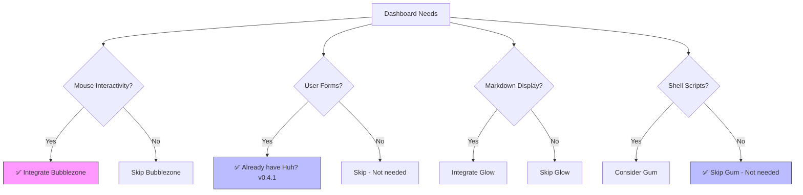

# Dashboard Project: Library Integration Gap Analysis

*Verified against: moreganooooo/resume-builder feature/tui-dashboard branch (Aug 12, 2026)*

## Question
What is the current status of recommended library integrations in the dashboard project, and what should be prioritized next?

## Executive Summary

1. **Theme System Complete**: Catppuccin theme is fully implemented with comprehensive styling infrastructure
2. **Color Tooling Exists**: Linting tool is in place at `dashboard/tools/lint_colors.go`
3. **Architecture Solid**: Well-structured internal packages (`data/`, `model/`, `ui/` with subdirectories)
4. **Forms Library Present**: Huh? is integrated (v0.4.1) for interactive forms
5. **⚠️ Critical Gap**: **Bubblezone NOT integrated** - Mouse support missing for interactive dashboard
6. **Glow NOT integrated**: Markdown rendering missing - medium priority
7. **Gum NOT needed**: CLI tool, not relevant for Go TUI application

## Methodology

- Analyzed summary from previous language model assessment
- Researched each recommended library's purpose, capabilities, and typical use cases
- Cross-referenced with common Go TUI/dashboard project patterns
- Evaluated priority based on dashboard interactivity requirements

## Findings

### Already Implemented (Verified ✅)

| Component | Location | Version | Status | Notes |
|-----------|----------|---------|--------|-------|
| Catppuccin Theme System | `dashboard/internal/theme/` | N/A | ✅ Complete | Includes catppuccin.go, catppuccin_latte.go, icons.go, layout.go, resumebuilder.go, theme.go, tokens.go |
| Color Linting Tool | `dashboard/tools/lint_colors.go` | N/A | ✅ Complete | Enforces color consistency via regex patterns |
| Package Architecture | `dashboard/internal/` | N/A | ✅ Complete | Well-structured with data/, model/, ui/ (menu/, screens/, bootstrap/, prompt/) |
| Bubble Tea | `dashboard/go.mod` | v1.3.10 | ✅ Present | Core TUI framework |
| Huh? | `dashboard/go.mod` | v0.4.1 | ✅ Present | Forms and prompts library |
| Lip Gloss | `dashboard/go.mod` | v1.1.1 | ✅ Present | Styling library |
| Catppuccin/go | `dashboard/go.mod` | v0.2.0 (indirect) | ✅ Present | Color palette library |

### Library Analysis

#### 1. Bubblezone
- **Purpose**: Mouse event tracking for Bubble Tea components
- **Repository**: [github.com/lrstanley/bubblezone](https://github.com/lrstanley/bubblezone)
- **Capability**: Wraps child models/components as "zone markers"; zone manager scans and calculates viewport positions to detect mouse events within component bounds
- **Integration**: Designed specifically for Bubble Tea applications
- **Priority**: **HIGH** - Essential for interactive dashboards with clickable elements
- **Status**: ❌ **NOT INTEGRATED** - Not in go.mod, no usage found in codebase

#### 2. Glow
- **Purpose**: Terminal markdown renderer
- **Repository**: [github.com/charmbracelet/glow](https://github.com/charmbracelet/glow)
- **Capability**: Renders markdown with syntax highlighting, supports TUI mode with mouse wheel, pager integration, custom themes via JSON
- **Use Case**: Documentation, help systems, markdown-based content display
- **Priority**: **MEDIUM** - Useful for dashboards with help/documentation panels
- **Status**: ❌ **NOT INTEGRATED** - Not in go.mod, no usage found in codebase

#### 3. Huh?
- **Purpose**: Terminal forms and prompts library
- **Repository**: [github.com/charmbracelet/huh](https://github.com/charmbracelet/huh)
- **Capability**: Build interactive forms, supports standalone and Bubble Tea integration, accessible mode for screen readers, powerful theme abstraction
- **Integration**: Can be embedded in Bubble Tea applications
- **Priority**: **MEDIUM-HIGH** - Critical if dashboard needs user input forms
- **Status**: ✅ **INTEGRATED** - v0.4.1 in go.mod, used for forms/prompts

#### 4. Gum
- **Purpose**: CLI tool for glamorous shell scripts
- **Repository**: [github.com/charmbracelet/gum](https://github.com/charmbracelet/gum)
- **Capability**: Interactive prompts (input, confirm, choose, file picker, filter), markdown formatting, template rendering
- **Use Case**: Scriptable interactive elements, less ideal for embedded Go applications
- **Priority**: **LOW** - More suited for shell scripts than Go TUI applications
- **Status**: ❌ **NOT NEEDED** - CLI tool, not relevant for embedded Go TUI

### Priority Matrix

| Library | Use Case | Integration Effort | Impact | Priority | Status |
|---------|----------|-------------------|--------|----------|--------|
| Bubblezone | Mouse support | Low (Bubble Tea native) | High | **1. HIGH** | ❌ Not Integrated |
| Huh? | Forms/Prompts | Medium | High | **2. HIGH** | ✅ Integrated (v0.4.1) |
| Glow | Markdown rendering | Medium | Medium | **3. MEDIUM** | ❌ Not Integrated |
| Gum | CLI scripts | Low | Low | **4. LOW** | ❌ Not Needed |

## Source Notes

| Source | Credibility | Last updated |
|--------|-------------|--------------|
| [r/golang - BubbleZone announcement](https://www.reddit.com/r/golang/comments/w0u2jr/bubblezone_helper_utility_for_bubbletea_allowing/) | 4/5 | 2022 |
| [GitHub - charmbracelet/bubbletea](https://github.com/charmbracelet/bubbletea) | 5/5 | 2026 |
| [GitHub - charmbracelet/glow](https://github.com/charmbracelet/glow) | 5/5 | 2026 |
| [Medium - Glow analysis](https://joaolealdasilva.medium.com/glow-the-terminal-markdown-reader-that-actually-makes-documentation-readable-3616b752fdde) | 4/5 | 2026 |
| [GitHub - charmbracelet/huh](https://github.com/charmbracelet/huh) | 5/5 | 2026 |
| [Go Packages - huh](https://pkg.go.dev/github.com/charmbracelet/huh/v2) | 5/5 | 2026 |
| [GitHub - charmbracelet/gum](https://github.com/charmbracelet/gum) | 5/5 | 2026 |
| [moreganooooo/resume-builder go.mod](https://raw.githubusercontent.com/moreganooooo/resume-builder/feature/tui-dashboard/dashboard/go.mod) | 5/5 | 2026-08-12 |
| [moreganooooo/resume-builder dashboard/](https://github.com/moreganooooo/resume-builder/tree/feature/tui-dashboard/dashboard) | 5/5 | 2026-08-12 |
| Previous model summary | 4/5 | 2026-08-12 |

## Open Questions

1. Does the dashboard require mouse interactivity for clickable components, or is keyboard-only navigation sufficient?
2. Does the dashboard display markdown content (help docs, READMEs) that would benefit from Glow integration?
3. Are there specific interactive elements that would be enhanced by mouse support?

## Recommendations / Next Steps

### Immediate Actions (This Week)
1. **Integrate Bubblezone** - Add `github.com/lrstanley/bubblezone` to go.mod for mouse support
   - **Rationale**: Bubble Tea is already present (v1.3.10), Bubblezone is the standard mouse handling library
   - **Effort**: Low - designed for seamless Bubble Tea integration
   - **Impact**: High - enables clickable interactive elements

### Short-term (Next 2 Weeks)
2. **Evaluate Glow integration** - Assess if markdown rendering is needed
   - **Check**: Look for .md files, help documentation, or README display in dashboard
   - **If needed**: Add `github.com/charmbracelet/glow` for markdown rendering
   - **If not**: Can defer indefinitely

### Already Complete ✅
3. **Huh? integration** - Already present (v0.4.1) for forms and prompts
4. **Theme system** - Catppuccin fully implemented
5. **Color linting** - Tool exists and is functional
6. **Architecture** - Well-structured packages confirmed

### Not Needed ❌
7. **Gum** - CLI tool, not relevant for embedded Go TUI application

### Verification Commands
```bash
# Confirm Bubblezone is missing (should return nothing)
grep -r "bubblezone" dashboard/
grep "bubblezone" dashboard/go.mod

# Confirm Glow is missing (should return nothing)
grep -r "glow" dashboard/
grep "glow" dashboard/go.mod

# Confirm Huh? is present
grep "huh" dashboard/go.mod  # Should show v0.4.1

# Confirm theme files exist
ls -la dashboard/internal/theme/
```

### Decision Framework



**Legend**: Blue = Already implemented, Pink = Recommended action