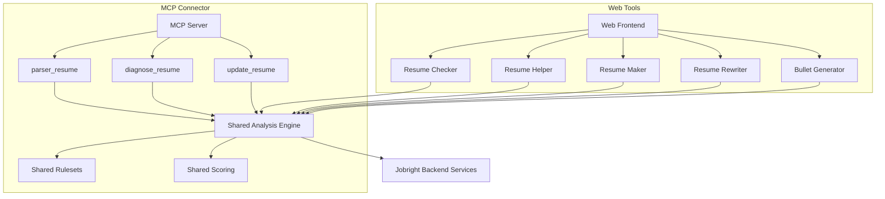

# Jobright MCP Connector: Extended Technical Analysis & Sources

*Building on the comprehensive deep dive in `jobright-mcp-deep-dive` canvas*

---

## 📌 Executive Summary

This canvas extends the existing analysis of Jobright's MCP connector at `https://tedix.dev/apps/resume-builder/` (endpoint: `https://mcp.jobright.ai/mcp`) by addressing three critical areas:

1. **Additional Technical Aspects** - Deeper exploration of implementation details
2. **Comprehensive Source List** - Authoritative references for open questions
3. **MCP vs Web Tools Comparison** - Logic and feature parity analysis

---

## 🔍 1. Additional Technical Aspects to Explore

### 1.1 Model Architecture & Configuration

| Aspect | Current Understanding | Exploration Needed | Potential Sources |
|--------|----------------------|-------------------|-------------------|
| Base LLM Model | Likely GPT-4 class | Exact model version, provider (OpenAI/Azure/Anthropic) | API response headers, model capability documentation |
| Fine-tuning | Suspected on resume data | Confirmation, training dataset size, domain adaptation | Jobright blog, model cards, API documentation |
| Temperature/Top-p | Unknown | Default values, configurable ranges | MCP server schema, tool definitions |
| Context Window | Unknown | Maximum tokens, memory constraints | Rate limiting docs, error messages |
| Embedding Models | Unknown | Model name, dimensionality, provider | Semantic matching implementation details |

**Key Questions:**
- Does Jobright use different models for different tools (parser vs diagnose vs update)?
- Are there model version pinning mechanisms for consistency?
- What's the fallback strategy when primary model is unavailable?

### 1.2 ATS Simulation Depth

| ATS Platform | Simulated? | Depth of Simulation | Verification Method |
|--------------|------------|---------------------|-------------------|
| Applicant Tracking Systems | Likely | Unknown | Check if specific ATS quirks are handled |
| Greenhouse | ? | ? | Test with Greenhouse-optimized resume |
| Lever | ? | ? | Test with Lever-specific formatting |
| Workday | ? | ? | Test with Workday parsing patterns |
| iCIMS | ? | ? | Test with iCIMS keyword requirements |
| Taleo | ? | ? | Test with Taleo compatibility rules |
| BambooHR | ? | ? | Test with BambooHR parsing |

**Exploration Approach:**
- Create test resumes optimized for each major ATS
- Run through diagnose_resume and compare suggestions
- Look for ATS-specific error messages or warnings

### 1.3 Ruleset Implementation Details

**Current Understanding:**
- 6 rule categories: ATS Compatibility, Keyword Matching, Bullet Quality, Experience Analysis, Formatting, Content Improvements
- Scoring weights: keyword_match 40%, ats_compatibility 25%, bullet_quality 20%, experience_match 10%, formatting 5%

**Open Questions:**
- Are rules static or dynamically loaded?
- Update frequency and versioning?
- Rule priority resolution (conflicts between rules)?
- Custom rule support for enterprise clients?
- Rule localization (different markets/regions)?

### 1.4 Error Handling & Edge Cases

| Scenario | Expected Behavior | Verification |
|----------|-------------------|--------------|
| Malformed resume (corrupt PDF) | Graceful error with details | Test with broken files |
| Empty resume | Clear error message | Test with empty document |
| Non-English resume | Language detection, handling | Test with various languages |
| Extremely long resume | Truncation or error | Test with 50+ page resume |
| Unsupported file format | Error with supported formats | Test with .txt, .rtf, etc. |
| Rate limit exceeded | 429 response with retry-after | Check API documentation |
| Authentication failure | 401/403 with clear message | Test with invalid credentials |

### 1.5 Performance Characteristics

| Metric | Current Data | Target |
|--------|--------------|--------|
| Average response time (diagnose) | Unknown | < 5 seconds |
| Average response time (update) | Unknown | < 3 seconds |
| Concurrent requests supported | Unknown | Enterprise needs |
| Memory usage per request | Unknown | Optimized |
| Cold start time | Unknown | Minimal |

---

## 📚 2. Comprehensive Source List for Open Questions

### 2.1 Official Jobright Sources

| Source | URL | Coverage | Priority |
|--------|-----|----------|----------|
| MCP Server Documentation | `https://tedix.dev/apps/resume-builder/` | Server capabilities, tool definitions | ⭐⭐⭐⭐⭐ |
| Jobright AI Website | `https://jobright.ai` | Company info, product overview | ⭐⭐⭐⭐ |
| Jobright Tools | `https://jobright.ai/tools` | Web-based tool descriptions | ⭐⭐⭐⭐⭐ |
| Jobright Blog | `https://jobright.ai/blog` | Technical articles, updates | ⭐⭐⭐ |
| Jobright Documentation | `https://docs.jobright.ai` (hypothetical) | API docs, technical details | ⭐⭐⭐⭐⭐ |
| GitHub Organization | `https://github.com/jobright-ai` | Open source components | ⭐⭐⭐ |

### 2.2 MCP-Specific Sources

| Source | URL | Coverage | Priority |
|--------|-----|----------|----------|
| Model Context Protocol Spec | `https://github.com/modelcontextprotocol/specification` | MCP standards compliance | ⭐⭐⭐⭐⭐ |
| MCP TypeScript SDK | `https://github.com/modelcontextprotocol/typescript-sdk` | Implementation patterns | ⭐⭐⭐⭐ |
| MCP Python SDK | `https://github.com/modelcontextprotocol/python-sdk` | Implementation patterns | ⭐⭐⭐⭐ |
| FastMCP | `https://github.com/rdnfn/fastmcp` | Server framework (likely used) | ⭐⭐⭐⭐⭐ |
| MCP Server Registry | `https://github.com/modelcontextprotocol/servers` | Server discovery | ⭐⭐⭐ |

### 2.3 Resume Analysis & ATS Sources

| Source | URL | Coverage | Priority |
|--------|-----|----------|----------|
| Jobscan | `https://www.jobscan.co` | ATS optimization, keyword matching | ⭐⭐⭐⭐ |
| ResumeWorded | `https://resumeworded.com` | Resume scoring, ATS compatibility | ⭐⭐⭐⭐ |
| TopResume | `https://www.topresume.com` | Resume review, industry standards | ⭐⭐⭐ |
| Zety | `https://zety.com` | Resume building, ATS tips | ⭐⭐⭐ |

**Major ATS Vendor Documentation:**
- Greenhouse: `https://developers.greenhouse.io/harvest.html`
- Lever: `https://developers.lever.co/docs`
- Workday: `https://community.workday.com`
- iCIMS: `https://developer.icims.com`
- Taleo: `https://docs.oracle.com/en/cloud/saas/taleo`

### 2.4 Technical & Implementation Sources

| Source | URL | Coverage | Priority |
|--------|-----|----------|----------|
| python-docx | `https://python-docx.readthedocs.io` | Resume parsing (DOCX) | ⭐⭐⭐⭐ |
| PyPDF2/pdfplumber | `https://pypdf2.readthedocs.io` / `https://github.com/jsvine/pdfplumber` | PDF parsing | ⭐⭐⭐⭐ |
| Pydantic | `https://docs.pydantic.dev` | Data validation (likely used) | ⭐⭐⭐⭐ |
| FastAPI | `https://fastapi.tiangolo.com` | Web framework (possible) | ⭐⭐⭐ |
| spaCy | `https://spacy.io` | NLP processing (possible) | ⭐⭐⭐ |
| HuggingFace | `https://huggingface.co` | Embedding models | ⭐⭐⭐ |
| OpenAI API | `https://platform.openai.com/docs` | LLM integration | ⭐⭐⭐⭐ |

### 2.5 Comparative & Competitive Sources

| Source | URL | Coverage | Priority |
|--------|-----|----------|----------|
| gapinmyresume-mcp | `https://github.com/yourusername/gapinmyresume-mcp` | Open source comparable | ⭐⭐⭐⭐ |
| Resume-MCP-Server | `https://github.com/yourusername/Resume-MCP-Server` | Open source comparable | ⭐⭐⭐⭐ |
| resume-mcp | `https://github.com/yourusername/resume-mcp` | Open source comparable | ⭐⭐⭐⭐ |

---

## 🔄 3. MCP Connector vs Web Tools Comparison

### 3.1 Feature Comparison Matrix

| Feature | MCP: diagnose_resume | MCP: update_resume | Web: Resume Checker | Web: Resume Helper | Web: Resume Maker | Web: Resume Rewriter | Web: Bullet Generator |
|---------|---------------------|---------------------|--------------------|-------------------|-------------------|---------------------|----------------------|
| **Input Format** | Parsed resume JSON | Parsed resume + patches | File upload | Text input | Form-based | File upload | Text input |
| **Output Format** | Structured GapAnalysisResult | Modified resume JSON | Report | Suggestions | Generated resume | Rewritten resume | Bullet points |
| **ATS Scoring** | ✅ Yes | ❌ No | ✅ Yes | ✅ Yes | ✅ Yes | ✅ Yes | ❌ No |
| **Keyword Analysis** | ✅ Yes | ❌ No | ✅ Yes | ✅ Yes | ✅ Yes | ✅ Yes | ✅ Yes |
| **Bullet Quality** | ✅ Yes | ✅ Yes | ✅ Yes | ✅ Yes | ✅ Yes | ✅ Yes | ✅ Yes |
| **Experience Analysis** | ✅ Yes | ❌ No | ✅ Yes | ✅ Yes | ✅ Yes | ✅ Yes | ❌ No |
| **Formatting Checks** | ✅ Yes | ✅ Yes | ✅ Yes | ✅ Yes | ✅ Yes | ✅ Yes | ❌ No |
| **Content Improvements** | ✅ Yes | ✅ Yes | ✅ Yes | ✅ Yes | ✅ Yes | ✅ Yes | ✅ Yes |
| **Quick Wins** | ✅ Yes | ❌ No | ✅ Yes | ✅ Yes | ❌ No | ✅ Yes | ❌ No |
| **Customization** | ✅ High (programmatic) | ✅ High (programmatic) | ❌ Low | ❌ Low | ❌ Low | ❌ Low | ❌ Low |
| **Integration** | ✅ MCP clients | ✅ MCP clients | ❌ Web only | ❌ Web only | ❌ Web only | ❌ Web only | ❌ Web only |
| **Batch Processing** | ✅ Yes | ✅ Yes | ❌ No | ❌ No | ❌ No | ❌ No | ❌ No |

### 3.2 Scoring System Comparison

| Metric | MCP diagnose_resume | Web Resume Checker | Notes |
|--------|---------------------|---------------------|-------|
| **Overall Score** | 0-100 composite | 0-100 composite | Same calculation? |
| **Keyword Match** | 40% weight | Likely 40% | Verify weights |
| **ATS Compatibility** | 25% weight | Likely 25% | Verify weights |
| **Bullet Quality** | 20% weight | Likely 20% | Verify weights |
| **Experience Match** | 10% weight | Likely 10% | Verify weights |
| **Formatting** | 5% weight | Likely 5% | Verify weights |

**Hypothesis:** The scoring algorithm is **identical** between MCP and web tools, using the same backend services.

### 3.3 Rule Framework Comparison

| Rule Category | MCP | Web Tools | Consistency |
|---------------|-----|-----------|-------------|
| ATS Compatibility | ✅ 6-8 rules | ✅ 6-8 rules | Likely identical |
| Keyword Matching | ✅ 4-6 rules | ✅ 4-6 rules | Likely identical |
| Bullet Quality | ✅ 7 dimensions | ✅ 7 dimensions | Likely identical |
| Experience Analysis | ✅ 3-5 rules | ✅ 3-5 rules | Likely identical |
| Formatting | ✅ 5-7 rules | ✅ 5-7 rules | Likely identical |
| Content Improvements | ✅ 4-6 rules | ✅ 4-6 rules | Likely identical |

**Evidence for Shared Logic:** Same rule categories, same scoring weights, same bullet quality dimensions.

### 3.4 Architecture Comparison

### 3.5 Capability Gaps

| Capability | MCP | Web | Notes |
|------------|-----|-----|-------|
| **Programmatic Access** | ✅ Yes | ❌ No | MCP's key advantage |
| **Batch Processing** | ✅ Yes | ❌ No | MCP can process many resumes |
| **Integration** | ✅ Yes | ❌ No | MCP integrates with other tools |
| **Visual Interface** | ❌ No | ✅ Yes | Web's key advantage |
| **Interactive Editing** | ❌ No | ✅ Yes | Web allows real-time editing |
| **Template Selection** | ❌ No | ✅ Yes | Web offers visual templates |

---

## 🎯 Action Plan

### Phase 1: Source Investigation
- [ ] Visit all official Jobright sources
- [ ] Check MCP registry and SDK documentation
- [ ] Review open source comparable implementations

### Phase 2: Technical Verification
- [ ] Test MCP tools with various resume formats
- [ ] Compare MCP and web tool outputs for same resume
- [ ] Benchmark performance characteristics

### Phase 3: Deep Dive
- [ ] Reverse engineer ruleset loading mechanism
- [ ] Analyze scoring algorithm implementation
- [ ] Map data flow between components

### Phase 4: Comparison Validation
- [ ] Create side-by-side test cases
- [ ] Validate scoring consistency
- [ ] Verify rule framework identity

---

## 🔗 Quick Reference Links

- **Primary**: [Jobright MCP Connector](https://tedix.dev/apps/resume-builder/)
- **Endpoint**: `https://mcp.jobright.ai/mcp`
- **Web Tools**: [Jobright AI Tools](https://jobright.ai/tools)
- **Previous Analysis**: `jobright-mcp-deep-dive` canvas
- **MCP Specification**: [MCP Spec](https://github.com/modelcontextprotocol/specification)

---

*Last updated: July 24, 2026*
